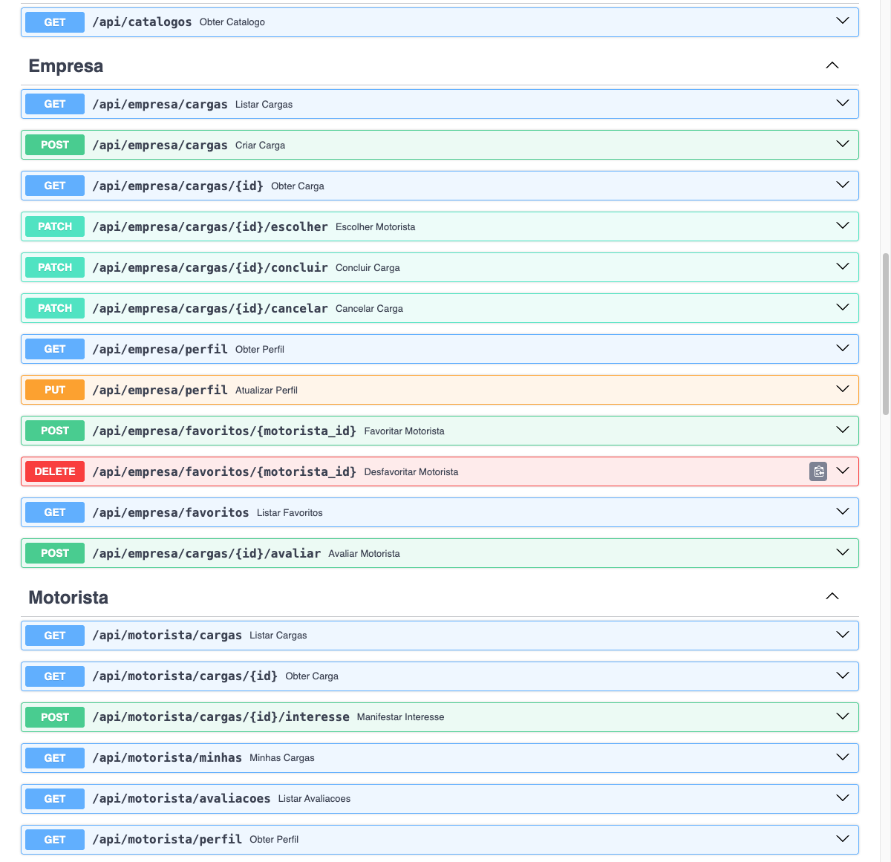
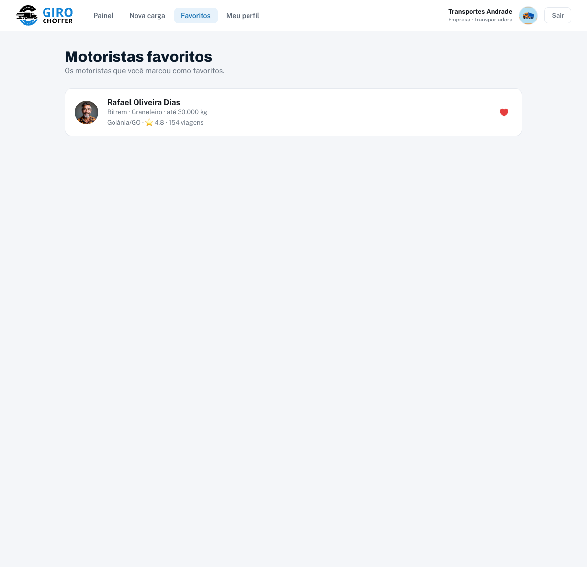
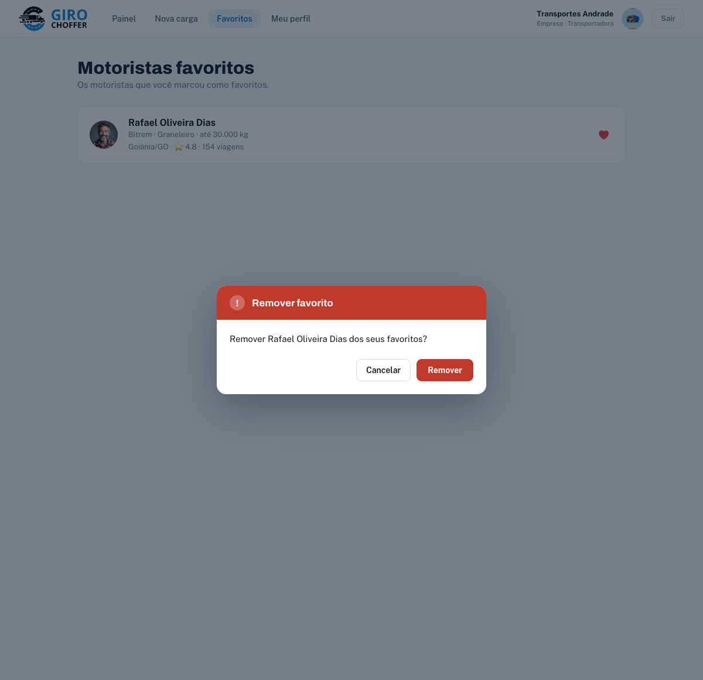
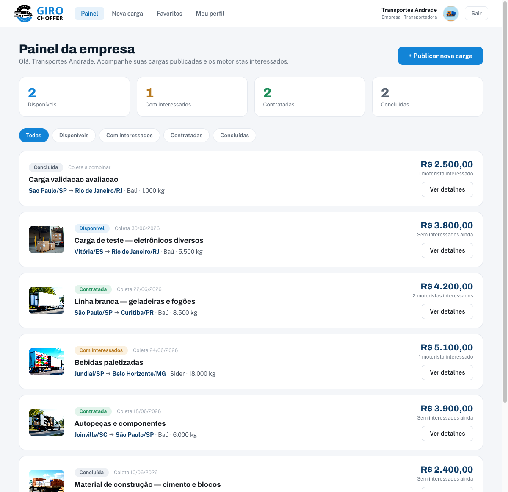
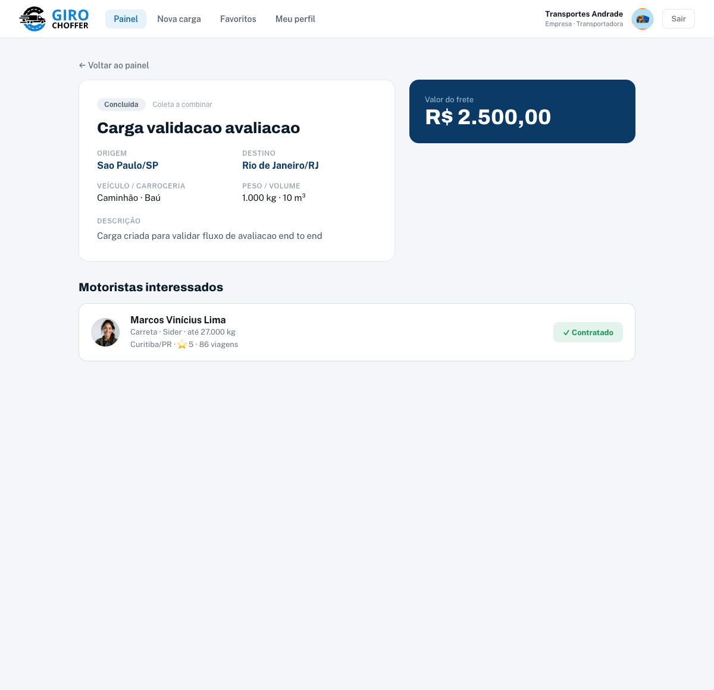

# Setup: preparando o seu computador do zero

Antes de programar qualquer coisa, você precisa deixar o projeto rodando na sua máquina. Esta seção ensina tudo desde o começo, sem assumir que você já tem nada instalado. Faça na ordem e, ao final, você terá o GiroChoffer abrindo no navegador.

> Por que tanto cuidado no começo? Porque 90% das dores de cabeça de quem está começando não estão no código, e sim no ambiente mal configurado. Dez minutos arrumando o ambiente agora economizam horas de erro estranho depois.

## 1. Instalar os programas que você vai usar

Você vai precisar de quatro programas. Instale todos antes de continuar.

- **Git** — guarda o histórico do seu código e baixa o projeto do GitHub. Baixe em https://git-scm.com/downloads.
- **Python 3.11 ou mais novo** — a linguagem do backend (a parte do servidor). Baixe em https://www.python.org/downloads/. Atenção: durante a instalação no Windows, marque a caixinha "Add Python to PATH".
- **Bun** — é o programa que instala as bibliotecas do frontend (a parte das telas) e roda o site em modo de desenvolvimento. Pense nele como uma versão mais rápida do clássico Node/npm. Instale seguindo as instruções de https://bun.sh. Neste projeto, o Bun é a ferramenta oficial: sempre que um comando antigo falar em `npm`, use o equivalente em `bun`.
- **VSCode** — o editor de código onde você vai escrever tudo. Baixe em https://code.visualstudio.com.

### Confira se deu certo

Abra um terminal (no Windows, o "Prompt de Comando" ou o "PowerShell"; no Mac/Linux, o "Terminal") e rode os comandos abaixo. Cada um deve responder com um número de versão, sem dar erro:

```bash
git --version
python --version
bun --version
```

> Se algum comando responder "não encontrado", o programa não foi instalado direito ou não está no PATH (a lista de lugares onde o sistema procura programas). Reinstale prestando atenção na opção de adicionar ao PATH.

> Sobre a versão do Python: o projeto tem um arquivo chamado `.python-version` que pede a versão 3.14. Essa versão pode ainda não existir no seu computador. Não tem problema: vamos criar o ambiente com o Python 3.11 (ou mais novo) que você acabou de instalar, e tudo funciona.

## 2. Baixar (clonar) o projeto

"Clonar" é o termo que o Git usa para baixar uma cópia completa do projeto, com todo o histórico. Escolha uma pasta onde você guarda seus projetos, abra o terminal nela e rode:

```bash
git clone https://github.com/Artleyfin/girochoffer.git
cd girochoffer
```

Agora você está dentro da pasta do projeto. Todos os próximos comandos partem daqui (a "raiz do projeto").

## 3. Criar uma branch para o seu trabalho

Antes de mexer no código, crie uma **branch** só sua. Branch é como uma linha do tempo paralela do projeto: você faz suas alterações nela sem bagunçar a versão principal (a `main`). Se algo der errado, é fácil voltar atrás.

```bash
git checkout -b minha-feature
```

> Por que isso importa? Trabalhar direto na `main` é arriscado: qualquer erro fica misturado com o código que já funciona. Numa branch separada, seu experimento fica isolado, e você só junta com a versão principal quando estiver tudo certo.

## 4. Preparar o backend (a parte do servidor)

O backend é escrito em Python. Vamos criar um **ambiente virtual** (chamado de `venv`): uma "caixinha" isolada onde ficam só as bibliotecas deste projeto, sem misturar com o resto do seu computador. Assim, um projeto não atrapalha o outro.

Ainda na raiz do projeto, entre na pasta do backend e crie o ambiente:

```bash
cd backend
python -m venv .venv
```

Agora **ative** o ambiente. O comando muda conforme o seu sistema:

- No Windows (PowerShell):

```bash
.venv\Scripts\Activate.ps1
```

- No Mac ou Linux:

```bash
source .venv/bin/activate
```

> Você sabe que deu certo quando aparece `(.venv)` no começo da linha do terminal. Sempre que abrir um terminal novo para mexer no backend, ative o ambiente de novo.

Com o ambiente ativo, instale as bibliotecas que o backend precisa:

```bash
pip install -r requirements.txt
```

## 5. Preparar o frontend (a parte das telas)

O frontend usa o Bun para instalar suas bibliotecas. Volte para a raiz e entre na pasta `frontend`:

```bash
cd ../frontend
bun install
```

Isso baixa tudo que as telas precisam para funcionar. Só é necessário na primeira vez (ou quando alguém adiciona uma biblioteca nova).

## 6. Rodar o projeto

Você vai precisar de **dois terminais abertos ao mesmo tempo**: um para o backend, outro para o frontend. Eles rodam juntos.

**Terminal 1 — Backend** (a partir da raiz do projeto, com o `.venv` ativado):

```bash
backend/.venv/bin/python backend/main.py
```

O backend sobe na porta `8412`. A documentação interativa da API (onde dá para testar as rotas no navegador) fica em `http://127.0.0.1:8412/docs`.

**Terminal 2 — Frontend** (a partir da pasta `frontend/`):

```bash
cd frontend
bun run dev
```

O Vite (a ferramenta que serve as telas em desenvolvimento) sobe na porta `5182`. Abra `http://127.0.0.1:5182` no navegador.

> Pronto! Para testar, entre com um usuário de demonstração (a senha padrão é `1234aA@#`). Há empresas e motoristas já cadastrados. Confirme que você consegue logar como **empresa**, ver o painel, e logar como **motorista**. Se tudo isso funciona, seu ambiente está pronto e você pode seguir para o tutorial.

## 7. Extensões recomendadas do VSCode

Extensões são complementos que deixam o editor mais inteligente. Abra o VSCode, clique no ícone de blocos na barra lateral (Extensions) e instale estas:

- **Python** — suporte básico à linguagem Python (rodar, depurar, reconhecer arquivos `.py`).
- **Pylance** — completa o código e avisa de erros de Python enquanto você digita.
- **Python Debugger** — permite pausar o código e investigar passo a passo o que está acontecendo.
- **Python Environments** — ajuda a escolher e gerenciar o ambiente virtual (`.venv`) certo.
- **ESLint** — aponta problemas e padroniza o código do frontend (JavaScript/TypeScript).
- **SQLite3 Editor** — abre e lê o banco de dados do projeto direto no editor, sem ferramenta externa.
- **vscode-icons** — coloca ícones bonitos nos arquivos, facilitando achar as coisas.
- **HTML CSS Support** — completa nomes de classes e tags ao escrever HTML e CSS.

---

# Tutorial: Empresa favoritar motoristas + Avaliar motorista pós-frete

Este tutorial ensina, passo a passo, do banco de dados até a tela, como implementar **duas funcionalidades** no projeto GiroChoffer. Ele foi escrito para quem está começando. Não pule nenhuma etapa: faça exatamente na ordem indicada, copiando os códigos e prestando atenção nas explicações.

---

## O que você vai construir

Você vai adicionar duas funcionalidades novas ao GiroChoffer, ambas "full-stack" (ou seja, mexem nas duas pontas do sistema: no backend, que é o servidor **e** no frontend, que são as telas):

**(A) Empresa favorita motoristas.** A empresa logada pode marcar um motorista como favorito (a partir do card do motorista interessado), desmarcar, e ver uma página com a lista dos seus motoristas favoritos.

**(B) Avaliar motorista pós-frete.** Depois que uma carga é **Concluída**, a empresa dá uma nota de 1 a 5 (com comentário) ao motorista que fez o frete. A nota recalcula a média (`motorista.nota`). O motorista pode listar as avaliações que recebeu, e a média aparece no card do motorista.

Resultado final esperado:

- Tabela nova `favorito_motorista`. Ela guarda um relacionamento **N:N** (lê-se "ene para ene") entre empresa e motorista. N:N quer dizer "muitos para muitos": uma empresa pode favoritar vários motoristas, e um mesmo motorista pode ser favorito de várias empresas. Vamos garantir que clicar em "favoritar" duas vezes no mesmo motorista não crie um favorito repetido. É o mesmo padrão já usado em `interesse_carga`.
- Tabela nova `avaliacao` (uma avaliação por carga, com `carga_id` único — ou seja, cada carga só pode ser avaliada uma vez).
- Rotas no backend (cada rota é um **endpoint**, isto é, um endereço da API que o frontend chama para fazer alguma coisa): `POST/DELETE/GET /empresa/favoritos`, `POST /empresa/cargas/{id}/avaliar`, `GET /motorista/avaliacoes`.
- Recálculo automático da média de notas do motorista (`motorista.nota`) a cada nova avaliação.
- Frontend: botão "Favoritar" no card do motorista, nova página `EmpresaFavoritosPage`, um item de menu novo, e a média de avaliação aparecendo no card.

---

## Pré-requisitos

Antes de programar, garanta que o projeto **roda** na sua máquina (se você seguiu a seção de Setup acima, já está tudo pronto). Abra dois terminais.

**Terminal 1 — Backend** (a partir da raiz do projeto):

```bash
backend/.venv/bin/python backend/main.py
```

> Atenção: use SEMPRE o Python do `.venv` (o `.python-version` aponta para uma versão que pode não estar instalada). O backend sobe na porta `8412`. A documentação interativa fica em `http://127.0.0.1:8412/docs`.

**Terminal 2 — Frontend** (a partir da pasta `frontend/`):

```bash
cd frontend
bun install      # só na primeira vez
bun run dev
```

> O Vite sobe na porta `5182` e faz "proxy" de `/api` para o backend (ou seja, encaminha para o servidor toda chamada que comece com `/api`). Abra `http://127.0.0.1:5182`.

Para testar, entre com um usuário de demonstração (a senha padrão é `1234aA@#`; "seed" é o conjunto de dados de exemplo que o projeto já vem com). Há empresas e motoristas já cadastrados. Confirme que você consegue logar como **empresa**, ver o painel, e logar como **motorista**.

Comandos úteis durante o desenvolvimento:

```bash
backend/.venv/bin/python -m pytest          # roda os testes do backend
cd frontend && bunx tsc -b --noEmit          # checa erros de tipo do TypeScript
cd frontend && bun run lint                 # checa o ESLint
```

---

## As camadas e a ordem de implementação

O backend do GiroChoffer é organizado em camadas: **Rotas → DTOs → Repositórios → SQL → Banco**. Cada camada tem uma função: a Rota recebe a chamada da tela, o **DTO** (sigla para "Data Transfer Object", ou "objeto de transferência de dados" — é o formato dos dados que entram e saem da API) confere se os dados estão certos, o Repositório conversa com o banco, e o SQL é a linguagem que o banco entende. O frontend segue o mesmo contrato da API: **api.ts → types.ts → schemas.ts → página → router/menu**.

Vamos implementar **de baixo para cima**. Essa ordem evita que você fique travado: cada camada que você cria já tem a camada de baixo pronta para usar.

Ordem completa:

1. **SQL** das tabelas novas (`favorito_motorista_sql.py`, `avaliacao_sql.py`).
2. **Model** de domínio da avaliação (`avaliacao_model.py`).
3. **Repositórios** (`favorito_motorista_repo.py`, `avaliacao_repo.py`).
4. **DTO de entrada** da avaliação (`avaliacao_dto.py`).
5. **Response (DTO de saída)** da avaliação (`avaliacao_response.py`).
6. **Rotas** (editar `empresa_routes.py` e `motorista_routes.py`).
7. **Registrar a tabela nova no startup** (editar `main.py`). ⚠️ Passo que mais se erra.
8. **Frontend: tipos** (`types.ts`).
9. **Frontend: schema Zod** (`schemas.ts`).
10. **Frontend: card e página** (`MotoristaInteressadoCard.tsx`, nova `EmpresaFavoritosPage.tsx`).
11. **Frontend: registrar rota e menu** (`router.tsx`, `Header.tsx`). ⚠️ Outro passo que se erra.

Por que de baixo para cima? Porque a rota chama o repositório, o repositório chama o SQL, e o frontend chama a rota. Se você começar pela tela, ainda não há o que chamar. Construindo a fundação primeiro, cada teste funciona assim que você termina a camada.

---

# PARTE 1 — BACKEND

## Passo 1.1 — SQL da tabela `favorito_motorista`

**Arquivo:** `backend/sql/favorito_motorista_sql.py` — **ARQUIVO NOVO**

Este arquivo contém apenas os comandos de SQL guardados como texto, seguindo exatamente o padrão de `backend/sql/interesse_carga_sql.py`. Veja: usamos `UNIQUE (empresa_id, motorista_id)` para garantir que o mesmo par empresa+motorista não se repita (ou seja, não dá para favoritar o mesmo motorista duas vezes), e `FOREIGN KEY ... ON DELETE CASCADE` para que, ao apagar a empresa ou o motorista, o favorito suma junto automaticamente.

```python
"""
SQL puro do relacionamento N:N empresa <-> motorista (favorito_motorista).

UNIQUE(empresa_id, motorista_id) garante idempotência do favorito (uma empresa
não favorita o mesmo motorista duas vezes). FKs ON DELETE CASCADE: ao remover a
empresa ou o motorista, os favoritos somem.

A leitura monta um "resumo de motorista" (dados do motorista + usuario + veículo
principal via catálogos), no mesmo formato usado por interesse_carga.
"""

CRIAR_TABELA = """
CREATE TABLE IF NOT EXISTS favorito_motorista (
    id INTEGER PRIMARY KEY AUTOINCREMENT,
    empresa_id INTEGER NOT NULL,
    motorista_id INTEGER NOT NULL,
    data_criacao TIMESTAMP DEFAULT CURRENT_TIMESTAMP,
    UNIQUE (empresa_id, motorista_id),
    FOREIGN KEY (empresa_id) REFERENCES empresa(id) ON DELETE CASCADE,
    FOREIGN KEY (motorista_id) REFERENCES motorista(id) ON DELETE CASCADE
)
"""

INSERIR = """
INSERT INTO favorito_motorista (empresa_id, motorista_id)
VALUES (?, ?)
"""

EXISTE = """
SELECT 1
FROM favorito_motorista
WHERE empresa_id = ? AND motorista_id = ?
LIMIT 1
"""

REMOVER = """
DELETE FROM favorito_motorista
WHERE empresa_id = ? AND motorista_id = ?
"""

# Motoristas favoritados por uma empresa, com dados de exibição (resumo).
# O veículo principal é o veículo ativo de menor id do motorista; seus nomes de
# tipo/carroceria vêm dos catálogos. Subquery escalar evita duplicar linhas.
OBTER_MOTORISTAS_POR_EMPRESA = """
SELECT m.id AS motorista_id,
       u.nome AS nome,
       m.cidade AS cidade,
       m.nota AS nota,
       m.total_viagens AS total_viagens,
       m.foto_url AS foto_url,
       v.id AS veiculo_id,
       tv.nome AS veiculo_principal,
       tc.nome AS carroceria,
       v.capacidade_kg AS capacidade_kg,
       fm.data_criacao AS data_favorito
FROM favorito_motorista fm
INNER JOIN motorista m ON fm.motorista_id = m.id
INNER JOIN usuario u ON m.usuario_id = u.id
LEFT JOIN veiculo v ON v.id = (
    SELECT v2.id FROM veiculo v2
    WHERE v2.motorista_id = m.id AND v2.ativo = 1
    ORDER BY v2.id
    LIMIT 1
)
LEFT JOIN tipo_veiculo tv ON v.tipo_veiculo_id = tv.id
LEFT JOIN tipo_carroceria tc ON v.tipo_carroceria_id = tc.id
WHERE fm.empresa_id = ?
ORDER BY fm.data_criacao DESC
"""
```

Pontos importantes:

- **Nomes em MAIÚSCULAS** (`CRIAR_TABELA`, `INSERIR`, etc.): é o jeito que este projeto combina de nomear esses textos de SQL. Seguir o padrão deixa tudo parecido e fácil de achar.
- **Todos os valores entram por `?`**: isso se chama "prepared statement" (comando preparado). Em vez de grudar o valor digitado pelo usuário direto no texto do SQL, você deixa um `?` no lugar e passa o valor separado. Nunca monte o SQL juntando texto com o valor dentro — isso abre uma brecha de segurança chamada "SQL injection" (quando alguém digita um comando malicioso no lugar de um dado comum), e o projeto proíbe.
- O `SELECT` (o comando que lê dados) é praticamente igual ao de `interesse_carga`, só trocando `interesse_carga`→`favorito_motorista` e `carga_id`→`empresa_id`. Reaproveitar o mesmo formato faz o card do frontend funcionar sem precisar de mudanças.

## Passo 1.2 — SQL da tabela `avaliacao`

**Arquivo:** `backend/sql/avaliacao_sql.py` — **ARQUIVO NOVO**

Aqui `carga_id` é **UNIQUE** (único): uma carga só pode ser avaliada uma vez. Note também o `CHECK (nota >= 1 AND nota <= 5)`, que é o próprio banco recusando qualquer nota fora do intervalo de 1 a 5 — uma trava de segurança na camada mais baixa, caso algum erro passe pelas camadas de cima.

```python
"""
SQL puro da tabela de avaliações (avaliacao).

Uma avaliação por carga (carga_id UNIQUE): a empresa avalia o motorista que fez
o frete, apenas depois de a carga estar Concluída. O CHECK garante a nota no
intervalo 1..5 também no nível do banco.

FKs ON DELETE CASCADE: ao remover a carga, a empresa ou o motorista, a avaliação
some junto. A leitura por motorista faz JOIN com empresa/carga para exibição.
"""

CRIAR_TABELA = """
CREATE TABLE IF NOT EXISTS avaliacao (
    id INTEGER PRIMARY KEY AUTOINCREMENT,
    carga_id INTEGER NOT NULL UNIQUE,
    empresa_id INTEGER NOT NULL,
    motorista_id INTEGER NOT NULL,
    nota INTEGER NOT NULL CHECK (nota >= 1 AND nota <= 5),
    comentario TEXT,
    data TIMESTAMP DEFAULT CURRENT_TIMESTAMP,
    FOREIGN KEY (carga_id) REFERENCES carga(id) ON DELETE CASCADE,
    FOREIGN KEY (empresa_id) REFERENCES empresa(id) ON DELETE CASCADE,
    FOREIGN KEY (motorista_id) REFERENCES motorista(id) ON DELETE CASCADE
)
"""

INSERIR = """
INSERT INTO avaliacao (carga_id, empresa_id, motorista_id, nota, comentario, data)
VALUES (?, ?, ?, ?, ?, ?)
"""

EXISTE_POR_CARGA = """
SELECT 1
FROM avaliacao
WHERE carga_id = ?
LIMIT 1
"""

# Média das notas de um motorista (None se ele ainda não tem avaliações).
MEDIA_POR_MOTORISTA = """
SELECT AVG(nota) AS media
FROM avaliacao
WHERE motorista_id = ?
"""

# Avaliações recebidas por um motorista, mais recentes primeiro, com o nome da
# empresa e o título da carga para exibição.
OBTER_POR_MOTORISTA = """
SELECT a.id AS id,
       a.carga_id AS carga_id,
       a.empresa_id AS empresa_id,
       a.motorista_id AS motorista_id,
       a.nota AS nota,
       a.comentario AS comentario,
       a.data AS data,
       e.nome_fantasia AS empresa_nome,
       c.titulo AS carga_titulo
FROM avaliacao a
INNER JOIN empresa e ON a.empresa_id = e.id
INNER JOIN carga c ON a.carga_id = c.id
WHERE a.motorista_id = ?
ORDER BY a.data DESC
"""
```

Pontos importantes:

- `carga_id INTEGER NOT NULL UNIQUE`: é o próprio banco garantindo a regra "uma avaliação por carga". Se alguém tentar avaliar a mesma carga de novo, o banco recusa.
- `MEDIA_POR_MOTORISTA` usa `AVG(nota)`, que calcula a média; se o motorista ainda não tem nenhuma avaliação, o `AVG` retorna `NULL` (um "vazio"). Vamos tratar esse caso no repositório, mais à frente.
- Na hora de gravar, passamos a data usando a função `agora()` (você verá no repositório). O `CURRENT_TIMESTAMP` que está no `CREATE TABLE` serve como rede de segurança, mas o projeto pede que você sempre use `agora()` ao salvar.

## Passo 1.3 — Model de domínio da avaliação

**Arquivo:** `backend/model/avaliacao_model.py` — **ARQUIVO NOVO**

O model (o "modelo") representa a avaliação dentro do código Python. Ele é um `@dataclass` puro (uma classe simples feita só para guardar dados) — e não um dicionário solto. Ele tem os mesmos campos da tabela e ainda inclui campos "derivados" (que vêm de um **JOIN**, isto é, de uma consulta que junta dados de mais de uma tabela), usados só para exibição na tela, exatamente como o `Carga` faz com `empresa_nome`.

```python
"""
Modelo de domínio de avaliação (GiroChoffer).

Uma avaliação registra a nota (1..5) e um comentário que a empresa dá ao
motorista após a conclusão de uma carga. Os campos empresa_nome e carga_titulo
são derivados de JOIN, apenas para exibição (não são colunas próprias).
"""

from dataclasses import dataclass
from datetime import datetime
from typing import Optional


@dataclass
class Avaliacao:
    """Avaliação de um motorista por uma empresa, referente a uma carga."""

    id: int
    carga_id: int
    empresa_id: int
    motorista_id: int
    nota: int
    comentario: Optional[str] = None
    data: Optional[datetime] = None
    # Campos derivados (JOIN) — só para exibição
    empresa_nome: Optional[str] = None
    carga_titulo: Optional[str] = None
```

> Não criamos um model para `favorito_motorista`. Igual a `interesse_carga`, o favorito é só uma ligação entre uma empresa e um motorista; suas leituras devolvem um "resumo de motorista" na forma de **dict** (dicionário: um conjunto de pares nome→valor). Fazemos assim para que este pedaço do código não fique preso (dependente) ao módulo de motorista. É exatamente o que o `interesse_carga_repo` já faz.

## Passo 1.4 — Repositório `favorito_motorista_repo`

**Arquivo:** `backend/repo/favorito_motorista_repo.py` — **ARQUIVO NOVO**

Este repositório é quase uma cópia de `interesse_carga_repo.py`. São funções soltas no arquivo (não há classe). A conexão com o banco vem sempre de `obter_conexao()` (que já salva as mudanças quando tudo dá certo e desfaz tudo quando dá erro). Para evitar favorito repetido, usamos o mesmo truque: `existe()` permite à rota responder com o código 409 (que significa "conflito"), e o `inserir()`, se o banco reclamar de duplicado (um `IntegrityError`), simplesmente devolve `None` em vez de derrubar o programa.

```python
"""
Repositório de Favoritos de Motorista (N:N empresa <-> motorista).

Espelha o padrão de interesse_carga_repo:
- existe(): permite à rota responder 409 sem depender da exceção de integridade.
- inserir(): idempotente; se já existir (viola UNIQUE), retorna None.
- remover(): apaga o vínculo (idempotente; True se removeu alguma linha).
- obter_motoristas_da_empresa(): retorna dicts no formato "resumo de motorista".
"""

import sqlite3
from typing import Optional

from sql.favorito_motorista_sql import (
    CRIAR_TABELA,
    INSERIR,
    EXISTE,
    REMOVER,
    OBTER_MOTORISTAS_POR_EMPRESA,
)
from util.db_util import obter_conexao
from util.logger_config import logger


def _row_to_motorista_resumo(row: sqlite3.Row) -> dict:
    """Converte row em dict no formato MotoristaResumo (campos de exibição)."""
    return {
        "id": row["motorista_id"],
        "nome": row["nome"],
        "cidade": row["cidade"],
        "nota": row["nota"],
        "total_viagens": row["total_viagens"],
        "foto_url": row["foto_url"],
        "veiculo_principal": row["veiculo_principal"],
        "carroceria": row["carroceria"],
        "capacidade_kg": row["capacidade_kg"],
    }


def criar_tabela() -> bool:
    """Cria a tabela de favoritos se não existir."""
    with obter_conexao() as conn:
        cursor = conn.cursor()
        cursor.execute(CRIAR_TABELA)
        return True


def existe(empresa_id: int, motorista_id: int) -> bool:
    """Verifica se essa empresa já favoritou esse motorista."""
    with obter_conexao() as conn:
        cursor = conn.cursor()
        cursor.execute(EXISTE, (empresa_id, motorista_id))
        return cursor.fetchone() is not None


def inserir(empresa_id: int, motorista_id: int) -> Optional[int]:
    """
    Marca um motorista como favorito de uma empresa.

    Idempotente: se já existir (viola UNIQUE), retorna None em vez de propagar a
    exceção de integridade. A rota deve checar existe() antes para responder 409.
    """
    try:
        with obter_conexao() as conn:
            cursor = conn.cursor()
            cursor.execute(INSERIR, (empresa_id, motorista_id))
            return cursor.lastrowid
    except sqlite3.IntegrityError:
        logger.info(
            f"Favorito já existente (empresa={empresa_id}, motorista={motorista_id})."
        )
        return None


def remover(empresa_id: int, motorista_id: int) -> bool:
    """Remove o favorito (True se alguma linha foi apagada)."""
    with obter_conexao() as conn:
        cursor = conn.cursor()
        cursor.execute(REMOVER, (empresa_id, motorista_id))
        return cursor.rowcount > 0


def obter_motoristas_da_empresa(empresa_id: int) -> list[dict]:
    """Lista os motoristas favoritados por uma empresa, como dicts de resumo."""
    with obter_conexao() as conn:
        cursor = conn.cursor()
        cursor.execute(OBTER_MOTORISTAS_POR_EMPRESA, (empresa_id,))
        return [_row_to_motorista_resumo(row) for row in cursor.fetchall()]
```

Pontos importantes:

- `criar_tabela()` é **obrigatória**: o `main.py` chama essa função quando o servidor liga (no "startup", a partida do sistema). Sem ela, a tabela nunca é criada no banco.
- `obter_motoristas_da_empresa()` devolve **dicts** com exatamente os mesmos nomes de campos de `MotoristaResumoResponse`. Por isso, na rota, conseguimos montar o objeto direto com `MotoristaResumoResponse(**d)`.

## Passo 1.5 — Repositório `avaliacao_repo`

**Arquivo:** `backend/repo/avaliacao_repo.py` — **ARQUIVO NOVO**

Aqui há uma novidade: além de gravar a avaliação, precisamos **recalcular** a média de notas e guardá-la em `motorista.nota`. Para isso, fazemos um pequeno `UPDATE motorista SET nota = ?` (um comando que altera um dado) dentro do repositório de avaliação — afinal, o repositório é o único lugar que deve conversar com o banco. Usamos `agora()` para a data, como manda a regra do projeto.

```python
"""
Repositório de Avaliações (GiroChoffer).

- inserir(): grava a avaliação (data via agora()). carga_id é UNIQUE: a rota deve
  checar existe_por_carga() antes para responder 409.
- media_por_motorista(): média das notas (0.0 se ainda não houver avaliações).
- recalcular_nota_motorista(): grava a média atual em motorista.nota.
- obter_por_motorista(): avaliações recebidas, com nome da empresa e título da
  carga (para exibição).
"""

import sqlite3
from typing import Optional

from model.avaliacao_model import Avaliacao
from sql.avaliacao_sql import (
    CRIAR_TABELA,
    INSERIR,
    EXISTE_POR_CARGA,
    MEDIA_POR_MOTORISTA,
    OBTER_POR_MOTORISTA,
)
from util.datetime_util import agora
from util.db_util import obter_conexao


def _row_to_avaliacao(row: sqlite3.Row) -> Avaliacao:
    """Converte sqlite3.Row em dataclass Avaliacao (com campos de JOIN)."""
    chaves = row.keys()
    return Avaliacao(
        id=row["id"],
        carga_id=row["carga_id"],
        empresa_id=row["empresa_id"],
        motorista_id=row["motorista_id"],
        nota=row["nota"],
        comentario=row["comentario"],
        data=row["data"],
        empresa_nome=row["empresa_nome"] if "empresa_nome" in chaves else None,
        carga_titulo=row["carga_titulo"] if "carga_titulo" in chaves else None,
    )


def criar_tabela() -> bool:
    """Cria a tabela de avaliações se não existir."""
    with obter_conexao() as conn:
        cursor = conn.cursor()
        cursor.execute(CRIAR_TABELA)
        return True


def existe_por_carga(carga_id: int) -> bool:
    """Verifica se a carga já foi avaliada (carga_id é UNIQUE)."""
    with obter_conexao() as conn:
        cursor = conn.cursor()
        cursor.execute(EXISTE_POR_CARGA, (carga_id,))
        return cursor.fetchone() is not None


def inserir(avaliacao: Avaliacao) -> Optional[int]:
    """
    Insere uma avaliação e retorna o id gerado.

    A data é definida via agora() (timezone da aplicação). carga_id é UNIQUE; a
    rota deve checar existe_por_carga() antes para responder 409 explicitamente.
    """
    with obter_conexao() as conn:
        cursor = conn.cursor()
        cursor.execute(INSERIR, (
            avaliacao.carga_id,
            avaliacao.empresa_id,
            avaliacao.motorista_id,
            avaliacao.nota,
            avaliacao.comentario,
            agora(),
        ))
        return cursor.lastrowid


def media_por_motorista(motorista_id: int) -> float:
    """Média das notas do motorista (0.0 se ele ainda não tem avaliações)."""
    with obter_conexao() as conn:
        cursor = conn.cursor()
        cursor.execute(MEDIA_POR_MOTORISTA, (motorista_id,))
        row = cursor.fetchone()
        media = row["media"] if row else None
        return round(float(media), 2) if media is not None else 0.0


def recalcular_nota_motorista(motorista_id: int) -> float:
    """
    Recalcula a média do motorista e grava em motorista.nota. Retorna a média.
    """
    media = media_por_motorista(motorista_id)
    with obter_conexao() as conn:
        cursor = conn.cursor()
        cursor.execute(
            "UPDATE motorista SET nota = ? WHERE id = ?",
            (media, motorista_id),
        )
    return media


def obter_por_motorista(motorista_id: int) -> list[Avaliacao]:
    """Lista as avaliações recebidas por um motorista (mais recentes primeiro)."""
    with obter_conexao() as conn:
        cursor = conn.cursor()
        cursor.execute(OBTER_POR_MOTORISTA, (motorista_id,))
        return [_row_to_avaliacao(row) for row in cursor.fetchall()]
```

Pontos importantes:

- `media_por_motorista` trata o caso do `AVG` vir vazio (`NULL`) devolvendo `0.0`. Sem esse cuidado, tentar transformar esse vazio em número (`float(None)`) derrubaria o programa.
- `recalcular_nota_motorista` faz o `UPDATE` direto, com um comando de SQL curto e bem específico escrito ali mesmo — o que é aceitável neste caso. A rota vai chamá-lo **logo depois** de gravar a avaliação.
- `agora()` vem de `util/datetime_util.py` e devolve a data/hora no fuso correto da aplicação. **Nunca** use `datetime.now()` no lugar dele.

## Passo 1.6 — DTO de entrada da avaliação

**Arquivo:** `backend/dtos/avaliacao_dto.py` — **ARQUIVO NOVO**

O DTO confere os dados que chegam no corpo da chamada `POST .../avaliar` (lembre: DTO é o formato dos dados que entram e saem da API). Usamos `validar_inteiro_range` (que já existe em `dtos/validators.py`) para garantir a nota entre 1 e 5, e `validar_comprimento` para limitar o comentário, que é opcional. Se a conferência falhar, o Pydantic (a biblioteca que valida os dados) avisa o erro, e o FastAPI responde com o código **422** (que significa "os dados enviados não estão no formato certo").

```python
"""
DTO de entrada da avaliação de um motorista (POST /empresa/cargas/{id}/avaliar).

Reaproveita os validators de dtos/validators.py: a nota é um inteiro de 1 a 5
e o comentário é opcional (até 500 caracteres).
"""

from typing import Optional

from pydantic import BaseModel, Field, field_validator

from dtos.validators import validar_inteiro_range, validar_comprimento


class AvaliarMotoristaDTO(BaseModel):
    """Corpo do POST /empresa/cargas/{id}/avaliar."""

    nota: int = Field(..., description="Nota de 1 a 5")
    comentario: Optional[str] = Field(default=None, description="Comentário (opcional)")

    _validar_nota = field_validator("nota")(
        validar_inteiro_range(min_valor=1, max_valor=5, nome_campo="Nota")
    )

    _validar_comentario = field_validator("comentario")(
        validar_comprimento(tamanho_maximo=500)
    )
```

Pontos importantes:

- A nota chega no JSON (o formato de texto usado para enviar dados entre a tela e o servidor) como número; o `int` do Pydantic e o `validar_inteiro_range(1, 5)` cuidam de conferir o resto.
- `validar_comprimento` deixa o campo ficar vazio (não é obrigatório) e só limita o tamanho quando há texto.

## Passo 1.7 — Response (DTO de saída) da avaliação

**Arquivo:** `backend/dtos/responses/avaliacao_response.py` — **ARQUIVO NOVO**

O Response é o que a API devolve para a tela, em JSON. Ele segue o padrão do projeto: uma `BaseModel` (classe-base do Pydantic) com um método de fábrica `classmethod de_avaliacao(...)` que monta o objeto a partir de uma avaliação. As datas viram texto no formato ISO (um padrão comum de data: ano-mês-dia). O Pydantic até transforma `datetime` sozinho, mas convertemos para `str` por garantia, para que a saída seja sempre igual.

```python
"""
Schema de resposta de avaliação (GiroChoffer).

Factory de_avaliacao() monta o response a partir da entidade Avaliacao, incluindo
os campos derivados (empresa_nome, carga_titulo) usados na lista do motorista.
"""

from typing import Optional

from pydantic import BaseModel

from model.avaliacao_model import Avaliacao


class AvaliacaoResponse(BaseModel):
    """Avaliação na visão de quem a recebeu (motorista) ou de quem a criou."""

    id: int
    carga_id: int
    empresa_id: int
    motorista_id: int
    nota: int
    comentario: Optional[str] = None
    data: Optional[str] = None
    empresa_nome: Optional[str] = None
    carga_titulo: Optional[str] = None

    @classmethod
    def de_avaliacao(cls, avaliacao: Avaliacao) -> "AvaliacaoResponse":
        """Constrói o response a partir da entidade Avaliacao."""
        return cls(
            id=avaliacao.id,
            carga_id=avaliacao.carga_id,
            empresa_id=avaliacao.empresa_id,
            motorista_id=avaliacao.motorista_id,
            nota=avaliacao.nota,
            comentario=avaliacao.comentario,
            data=str(avaliacao.data) if avaliacao.data else None,
            empresa_nome=avaliacao.empresa_nome,
            carga_titulo=avaliacao.carga_titulo,
        )
```

## Passo 1.8 — Rotas da Empresa: favoritar e avaliar

**Arquivo:** `backend/routes/empresa_routes.py` — **EDIÇÃO**

Vamos adicionar **quatro** endpoints (endereços da API) à empresa: favoritar, desfavoritar, listar favoritos, e avaliar. Faça três pequenas alterações neste arquivo.

### 1.8.a — Novos imports

Encontre o bloco de imports no topo. Logo abaixo da linha que importa os DTOs de carga:

```python
# DTOs (entrada)
from dtos.carga_dto import NovaCargaDTO, EscolherMotoristaDTO
from dtos.empresa_dto import AtualizarEmpresaDTO
```

acrescente o import do DTO de avaliação:

```python
from dtos.avaliacao_dto import AvaliarMotoristaDTO
```

Na seção de responses, abaixo de:

```python
from dtos.responses.motorista_response import MotoristaResumoResponse
```

acrescente:

```python
from dtos.responses.avaliacao_response import AvaliacaoResponse
from dtos.responses.comum import MensagemResponse
```

> `PaginaResponse` já estava importado de `comum`; agora importamos também `MensagemResponse` (usado nas respostas de favoritar/desfavoritar).

Na seção de repositórios, troque a linha:

```python
from repo import carga_repo, empresa_repo, interesse_carga_repo
```

por:

```python
from repo import (
    carga_repo,
    empresa_repo,
    interesse_carga_repo,
    favorito_motorista_repo,
    avaliacao_repo,
)
```

### 1.8.b — Novos rate limiters

Um "rate limiter" é um limitador que controla quantas vezes alguém pode chamar uma rota num certo tempo, para evitar abuso. Logo após o `empresa_perfil_limiter` (no bloco "Rate Limiters"), adicione dois limitadores. Eles seguem o mesmo molde dos que já existem:

```python
empresa_favorito_limiter = DynamicRateLimiter(
    chave_max="rate_limit_empresa_favorito_max",
    chave_minutos="rate_limit_empresa_favorito_minutos",
    padrao_max=60,
    padrao_minutos=10,
    nome="empresa_favorito",
)
empresa_avaliar_limiter = DynamicRateLimiter(
    chave_max="rate_limit_empresa_avaliar_max",
    chave_minutos="rate_limit_empresa_avaliar_minutos",
    padrao_max=30,
    padrao_minutos=10,
    nome="empresa_avaliar",
)
```

### 1.8.c — Endpoints novos

Adicione os endpoints abaixo no fim do arquivo (depois das rotas de perfil). Repare em cada padrão que é obrigatório seguir, igual ao das rotas que já existem:

- `@router.<metodo>(...)` em cima (o "decorador" que define o método e o caminho da rota), e `@requer_autenticacao([Perfil.EMPRESA.value])` logo abaixo (que exige login de empresa).
- `request: Request` é o **primeiro** parâmetro; `usuario_logado: Optional[UsuarioLogado] = None` é o **último**; e, dentro da função, `assert usuario_logado is not None` (confirma que existe um usuário logado).
- Erros sempre são avisados com `raise HTTPException(...)`.

```python
# =============================================================================
# Favoritar motorista (N:N empresa <-> motorista)
# =============================================================================

@router.post("/favoritos/{motorista_id}", response_model=MensagemResponse)
@requer_autenticacao([Perfil.EMPRESA.value])
async def favoritar_motorista(
    request: Request,
    motorista_id: int,
    usuario_logado: Optional[UsuarioLogado] = None,
):
    """Marca um motorista como favorito da empresa logada (idempotente; 409 se já existe)."""
    assert usuario_logado is not None
    checar_rate_limit(empresa_favorito_limiter, request)

    empresa = _obter_empresa_logada(usuario_logado)

    if favorito_motorista_repo.existe(empresa.id, motorista_id):
        raise HTTPException(
            status_code=status.HTTP_409_CONFLICT,
            detail="Este motorista já está nos seus favoritos.",
        )

    favorito_id = favorito_motorista_repo.inserir(empresa.id, motorista_id)
    if not favorito_id:
        # Corrida: outro request inseriu entre o existe() e o inserir().
        raise HTTPException(
            status_code=status.HTTP_409_CONFLICT,
            detail="Este motorista já está nos seus favoritos.",
        )

    logger.info(f"Empresa {empresa.id} favoritou o motorista {motorista_id}")
    return MensagemResponse(message="Motorista adicionado aos favoritos.")


@router.delete("/favoritos/{motorista_id}", response_model=MensagemResponse)
@requer_autenticacao([Perfil.EMPRESA.value])
async def desfavoritar_motorista(
    request: Request,
    motorista_id: int,
    usuario_logado: Optional[UsuarioLogado] = None,
):
    """Remove um motorista dos favoritos da empresa logada (404 se não era favorito)."""
    assert usuario_logado is not None
    checar_rate_limit(empresa_favorito_limiter, request)

    empresa = _obter_empresa_logada(usuario_logado)

    if not favorito_motorista_repo.remover(empresa.id, motorista_id):
        raise HTTPException(
            status_code=status.HTTP_404_NOT_FOUND,
            detail="Este motorista não estava nos seus favoritos.",
        )

    logger.info(f"Empresa {empresa.id} removeu o motorista {motorista_id} dos favoritos")
    return MensagemResponse(message="Motorista removido dos favoritos.")


@router.get("/favoritos", response_model=list[MotoristaResumoResponse])
@requer_autenticacao([Perfil.EMPRESA.value])
async def listar_favoritos(
    request: Request,
    usuario_logado: Optional[UsuarioLogado] = None,
):
    """Lista os motoristas favoritados pela empresa logada."""
    assert usuario_logado is not None

    empresa = _obter_empresa_logada(usuario_logado)

    favoritos_dicts = favorito_motorista_repo.obter_motoristas_da_empresa(empresa.id)
    return [MotoristaResumoResponse(**d) for d in favoritos_dicts]


# =============================================================================
# Avaliar motorista (apenas carga Concluída)
# =============================================================================

@router.post("/cargas/{id}/avaliar", response_model=AvaliacaoResponse, status_code=status.HTTP_201_CREATED)
@requer_autenticacao([Perfil.EMPRESA.value])
async def avaliar_motorista(
    request: Request,
    id: int,
    dto: AvaliarMotoristaDTO,
    usuario_logado: Optional[UsuarioLogado] = None,
):
    """Avalia o motorista que fez o frete. Só permitido se a carga estiver Concluída."""
    assert usuario_logado is not None
    checar_rate_limit(empresa_avaliar_limiter, request)

    empresa = _obter_empresa_logada(usuario_logado)
    carga = _obter_carga_da_empresa(id, empresa)

    if carga.status != StatusCarga.CONCLUIDA:
        raise HTTPException(
            status_code=status.HTTP_409_CONFLICT,
            detail="Só é possível avaliar uma carga já concluída.",
        )

    if carga.motorista_escolhido_id is None:
        raise HTTPException(
            status_code=status.HTTP_422_UNPROCESSABLE_ENTITY,
            detail="Esta carga não tem um motorista contratado para avaliar.",
        )

    if avaliacao_repo.existe_por_carga(id):
        raise HTTPException(
            status_code=status.HTTP_409_CONFLICT,
            detail="Esta carga já foi avaliada.",
        )

    avaliacao = Avaliacao(
        id=0,
        carga_id=id,
        empresa_id=empresa.id,
        motorista_id=carga.motorista_escolhido_id,
        nota=dto.nota,
        comentario=dto.comentario,
    )
    avaliacao_id = avaliacao_repo.inserir(avaliacao)
    if not avaliacao_id:
        raise HTTPException(
            status_code=status.HTTP_500_INTERNAL_SERVER_ERROR,
            detail="Erro ao registrar a avaliação. Tente novamente.",
        )

    # Recalcula e grava a média do motorista (motorista.nota).
    avaliacao_repo.recalcular_nota_motorista(carga.motorista_escolhido_id)

    logger.info(
        f"Empresa {empresa.id} avaliou a carga {id} "
        f"(motorista {carga.motorista_escolhido_id}, nota {dto.nota})"
    )

    criada = avaliacao_repo.obter_por_motorista(carga.motorista_escolhido_id)
    # A avaliação recém-criada é a mais recente (lista ordenada por data DESC).
    return AvaliacaoResponse.de_avaliacao(criada[0])
```

Você também precisa importar o model `Avaliacao` no topo deste arquivo (junto dos outros models). Abaixo de:

```python
from model.carga_model import Carga, StatusCarga
```

acrescente:

```python
from model.avaliacao_model import Avaliacao
```

Pontos importantes:

- O motorista avaliado **não** é informado no corpo da chamada: ele é sempre o `carga.motorista_escolhido_id`, ou seja, o motorista que de fato fez aquele frete. Assim a empresa não consegue avaliar um motorista que não trabalhou para ela.
- A ordem das conferências importa: primeiro 404/403 (a carga é mesmo desta empresa? — quem faz isso é `_obter_carga_da_empresa`), depois 409 (a carga está Concluída?), depois 422 (a carga tem um motorista contratado?), e por fim 409 de novo (essa carga já foi avaliada?). Cada número é um código de resposta diferente para cada situação.
- Logo depois de gravar, chamamos `recalcular_nota_motorista`. É isso que faz a média aparecer atualizada no card do motorista.

## Passo 1.9 — Rota do Motorista: listar avaliações recebidas

**Arquivo:** `backend/routes/motorista_routes.py` — **EDIÇÃO**

Adicione o endpoint `GET /motorista/avaliacoes`. Faça três alterações.

### 1.9.a — Imports

Na seção de responses, abaixo de:

```python
from dtos.responses.motorista_response import MotoristaResponse
```

acrescente:

```python
from dtos.responses.avaliacao_response import AvaliacaoResponse
```

Na seção de repositórios, adicione `avaliacao_repo` à lista de imports:

```python
from repo import (
    carga_repo,
    interesse_carga_repo,
    motorista_repo,
    veiculo_repo,
    avaliacao_repo,
)
```

### 1.9.b — Rate limiter

Junto dos outros limitadores deste arquivo, adicione:

```python
motorista_avaliacoes_limiter = DynamicRateLimiter(
    chave_max="rate_limit_motorista_avaliacoes_max",
    chave_minutos="rate_limit_motorista_avaliacoes_minutos",
    padrao_max=60,
    padrao_minutos=1,
    nome="motorista_avaliacoes",
)
```

### 1.9.c — Endpoint

Adicione, por exemplo, logo antes da seção "Perfil do motorista":

```python
# =============================================================================
# Avaliações recebidas
# =============================================================================

@router.get("/avaliacoes", response_model=list[AvaliacaoResponse])
@requer_autenticacao([Perfil.MOTORISTA.value])
async def listar_avaliacoes(
    request: Request,
    usuario_logado: Optional[UsuarioLogado] = None,
):
    """Lista as avaliações recebidas pelo motorista logado (mais recentes primeiro)."""
    assert usuario_logado is not None
    checar_rate_limit(motorista_avaliacoes_limiter, request)
    motorista = _obter_motorista_logado(usuario_logado)

    avaliacoes = avaliacao_repo.obter_por_motorista(motorista.id)
    return [AvaliacaoResponse.de_avaliacao(a) for a in avaliacoes]
```

## Passo 1.10 — Registrar as tabelas novas no startup ⚠️

**Arquivo:** `backend/main.py` — **EDIÇÃO**

Este é o passo que mais se erra. Se você não registrar a tabela aqui, ela **nunca é criada** no banco, e toda chamada que mexe nela vai falhar com o erro "no such table" ("não existe essa tabela"). Faça duas alterações.

### 1.10.a — Importar os repositórios novos

Encontre o segundo bloco de import de repositórios (o do GiroChoffer):

```python
from repo import (
    catalogo_repo,
    empresa_repo,
    motorista_repo,
    veiculo_repo,
    carga_repo,
    interesse_carga_repo,
)
```

Acrescente os dois repos novos:

```python
from repo import (
    catalogo_repo,
    empresa_repo,
    motorista_repo,
    veiculo_repo,
    carga_repo,
    interesse_carga_repo,
    favorito_motorista_repo,
    avaliacao_repo,
)
```

### 1.10.b — Registrar na lista `TABELAS`

Encontre a lista `TABELAS`. Adicione as duas tabelas novas **depois** de `motorista` e `carga`. A ordem importa porque elas têm FK (chave estrangeira — uma ligação que aponta para outra tabela) para essas tabelas, e a tabela apontada precisa existir antes. Coloque-as logo após `interesse_carga`:

```python
TABELAS = [
    (usuario_repo, "usuario"),
    # GiroChoffer (ordem de FK; catalogo_repo cria tipo_veiculo + tipo_carroceria)
    (catalogo_repo, "tipo_veiculo + tipo_carroceria"),
    (empresa_repo, "empresa"),
    (motorista_repo, "motorista"),
    (veiculo_repo, "veiculo"),
    (carga_repo, "carga"),
    (interesse_carga_repo, "interesse_carga"),
    (favorito_motorista_repo, "favorito_motorista"),   # <-- NOVO
    (avaliacao_repo, "avaliacao"),                      # <-- NOVO
    (configuracao_repo, "configuracao"),
]
```

> Por que a ordem importa? `favorito_motorista` aponta para `empresa` e `motorista`; `avaliacao` aponta para `carga`, `empresa` e `motorista`. Como o SQLite (o banco de dados deste projeto) cria essas ligações no momento do `CREATE TABLE`, as tabelas apontadas precisam já existir. Colocá-las depois de `carga` e `motorista` garante isso.

> **Não é preciso registrar um router novo:** as rotas novas foram adicionadas a routers que **já existem** (`empresa_router` e `motorista_router`) — um "router" é o arquivo que agrupa rotas parecidas. Eles já estão na lista `ROUTERS`. Se algum dia você criar um router em um **arquivo novo**, aí sim você teria que importá-lo e adicioná-lo em `ROUTERS` no `main.py` — foi assim que `empresa_router` e `motorista_router` chegaram lá.

### 1.10.c — Reinicie o backend

Pare o backend (Ctrl+C no Terminal 1) e suba de novo:

```bash
backend/.venv/bin/python backend/main.py
```

Procure no log (as mensagens que o servidor escreve no terminal) as linhas `Tabela 'favorito_motorista' criada/verificada` e `Tabela 'avaliacao' criada/verificada`. Se elas aparecerem, as tabelas foram criadas. Abra `http://127.0.0.1:8412/docs` e confirme que os endpoints novos aparecem.



---

# PARTE 2 — FRONTEND

## Passo 2.1 — Tipos espelhados

**Arquivo:** `frontend/src/lib/types.ts` — **EDIÇÃO**

Os tipos do frontend (que descrevem o formato dos dados no TypeScript) têm que bater **exatos** com os Response DTOs do backend, para os dois lados se entenderem. Adicione a interface de avaliação. Coloque, por exemplo, logo após o bloco `// ===== Motorista =====`:

```ts
// ===== Avaliação =====
export interface Avaliacao {
  id: number
  carga_id: number
  empresa_id: number
  motorista_id: number
  nota: number
  comentario?: string | null
  data?: string | null
  empresa_nome?: string | null
  carga_titulo?: string | null
}
```

> Repare: nomes em **snake_case**, iguais ao JSON do backend (`carga_id`, `empresa_nome`). O tipo `MotoristaResumo` já existe e é o que `GET /empresa/favoritos` retorna (lista de `MotoristaResumo`), então não precisamos criar nada novo para a lista de favoritos.

## Passo 2.2 — Schema Zod da avaliação

**Arquivo:** `frontend/src/lib/schemas.ts` — **EDIÇÃO**

O schema (esquema) confere o formulário de avaliação já no navegador, antes mesmo de enviar para o servidor, espelhando o `AvaliarMotoristaDTO` do backend. Assim o usuário recebe o aviso de erro na hora. Adicione ao fim do arquivo:

```ts
// ===== Avaliação (empresa avalia motorista) =====

export const avaliarMotoristaSchema = z.object({
  nota: z.coerce
    .number({ message: 'Informe a nota' })
    .int('A nota deve ser um número inteiro')
    .min(1, 'A nota mínima é 1')
    .max(5, 'A nota máxima é 5'),
  comentario: z
    .string()
    .trim()
    .max(500, 'O comentário deve ter no máximo 500 caracteres')
    .optional(),
})
export type AvaliarMotoristaForm = z.infer<typeof avaliarMotoristaSchema>
```

Pontos importantes:

- `z.coerce.number()` converte o valor do `<select>`/`<input>` (que sempre chega como texto) para número.
- Os limites `1..5` e `max(500)` repetem exatamente as regras do backend. Se você mudar um lado, mude o outro também, senão eles vão discordar.

## Passo 2.3 — Botão "Favoritar" no card do motorista

**Arquivo:** `frontend/src/components/giro/MotoristaInteressadoCard.tsx` — **EDIÇÃO**

Vamos adicionar duas coisas ao card: (1) um botão de favoritar/desfavoritar (um coração), e (2) já que a média de avaliação (`nota`) vem junto no `MotoristaResumo`, ela continua aparecendo no card como `⭐ {m.nota}` — você não precisa mudar isso, só confirmar que está lá.

Primeiro, amplie as **props** do componente (as "props" são os dados que um componente recebe de quem o usa) para receber o estado de favorito e a função de callback (a função que será chamada quando o usuário clicar). Troque a assinatura:

```tsx
export default function MotoristaInteressadoCard({
  motorista,
  escolhido = false,
  podeEscolher = false,
  onEscolher,
}: {
  motorista: MotoristaResumo
  escolhido?: boolean
  podeEscolher?: boolean
  onEscolher?: () => void
}) {
```

por esta (note os campos novos `favorito` e `onToggleFavorito`):

```tsx
export default function MotoristaInteressadoCard({
  motorista,
  escolhido = false,
  podeEscolher = false,
  onEscolher,
  favorito = false,
  onToggleFavorito,
}: {
  motorista: MotoristaResumo
  escolhido?: boolean
  podeEscolher?: boolean
  onEscolher?: () => void
  favorito?: boolean
  onToggleFavorito?: () => void
}) {
```

Agora, dentro do `return`, logo **antes** do bloco `{podeEscolher && (...)}`, adicione o botão de favoritar. Ele só aparece se o componente receber a função `onToggleFavorito`:

```tsx
      {onToggleFavorito && (
        <button
          onClick={onToggleFavorito}
          title={favorito ? 'Remover dos favoritos' : 'Adicionar aos favoritos'}
          style={{
            background: 'transparent',
            border: 'none',
            cursor: 'pointer',
            fontSize: '22px',
            lineHeight: 1,
            color: favorito ? '#E53E3E' : colors.muted,
            flex: 'none',
          }}
        >
          {favorito ? '♥' : '♡'}
        </button>
      )}
```

Pontos importantes:

- Os novos parâmetros têm um **valor padrão** (`favorito = false`) e a função de callback é **opcional**. Por isso, as telas que já usam este card (como `EmpresaDetalhesPage`) continuam funcionando sem precisar de nenhuma mudança.
- O coração cheio (`♥`) indica que o motorista é favorito; o coração vazado (`♡`), que não é.

## Passo 2.4 — Nova página de favoritos

**Arquivo:** `frontend/src/pages/giro/EmpresaFavoritosPage.tsx` — **ARQUIVO NOVO**

Esta página lista os motoristas favoritos e permite desfavoritar (sempre pedindo confirmação com `pedirConfirmacao`, e **nunca** com o `confirm()` padrão do navegador, que é feio e não combina com o resto do site). Ela usa o hook `useFetch` para buscar os dados (um "hook" é uma função pronta do React que adiciona um comportamento ao componente — aqui, carregar dados da API). As chamadas passam sempre pelo `api` central, e os avisos ao usuário aparecem como `toast` (aquelas mensagens que surgem por alguns segundos no canto da tela).

```tsx
import { useCallback, useState } from 'react'
import { api, ApiError } from '@/lib/api'
import type { MotoristaResumo } from '@/lib/types'
import { colors, fonts } from '@/lib/theme'
import { useFetch } from '@/hooks/useFetch'
import { toast, useUIStore } from '@/store/uiStore'
import MotoristaInteressadoCard from '@/components/giro/MotoristaInteressadoCard'
import EmptyState from '@/components/giro/EmptyState'
import Spinner from '@/components/ui/Spinner'

/* Página de motoristas favoritos da EMPRESA (rota /empresa/favoritos).
   Lista os favoritos e permite desfavoritar. */

export default function EmpresaFavoritosPage() {
  const pedirConfirmacao = useUIStore((s) => s.pedirConfirmacao)
  const [agindo, setAgindo] = useState(false)

  const carregar = useCallback(
    (signal: AbortSignal) => api.get<MotoristaResumo[]>('/empresa/favoritos', { signal }),
    [],
  )
  const { data: favoritos, carregando, erro, recarregar } = useFetch<MotoristaResumo[]>(carregar, [])

  function desfavoritar(motoristaId: number, nome: string) {
    pedirConfirmacao({
      titulo: 'Remover favorito',
      mensagem: `Remover ${nome} dos seus favoritos?`,
      textoConfirmar: 'Remover',
      tipo: 'danger',
      onConfirmar: async () => {
        setAgindo(true)
        try {
          await api.delete(`/empresa/favoritos/${motoristaId}`)
          toast.sucesso('Motorista removido dos favoritos.')
          recarregar()
        } catch (e) {
          toast.erro(e instanceof ApiError ? e.message : 'Não foi possível remover o favorito.')
        } finally {
          setAgindo(false)
        }
      },
    })
  }

  return (
    <div style={{ maxWidth: '1000px', margin: '0 auto', padding: '36px 32px 64px' }}>
      <h1
        style={{
          fontFamily: fonts.heading,
          fontWeight: 800,
          fontSize: '30px',
          color: colors.inkStrong,
          margin: '0 0 4px',
        }}
      >
        Motoristas favoritos
      </h1>
      <p style={{ margin: '0 0 28px', color: colors.muted, fontSize: '15px' }}>
        Os motoristas que você marcou como favoritos.
      </p>

      {carregando ? (
        <Spinner texto="Carregando favoritos..." />
      ) : erro ? (
        <EmptyState>Não foi possível carregar seus favoritos. Tente novamente.</EmptyState>
      ) : !favoritos || favoritos.length === 0 ? (
        <EmptyState padding="48px">Você ainda não favoritou nenhum motorista.</EmptyState>
      ) : (
        <div style={{ display: 'flex', flexDirection: 'column', gap: '12px' }}>
          {favoritos.map((m) => (
            <MotoristaInteressadoCard
              key={m.id}
              motorista={m}
              favorito
              onToggleFavorito={agindo ? undefined : () => desfavoritar(m.id, m.nome)}
            />
          ))}
        </div>
      )}
    </div>
  )
}
```

Pontos importantes:

- `api.get<MotoristaResumo[]>('/empresa/favoritos', ...)`: o caminho é **relativo a `/api`** (não escreva `/api/empresa/favoritos`, pois o `/api` já é colocado automaticamente).
- Passamos `favorito` (sempre verdadeiro nesta tela, já que todos os motoristas aqui são favoritos) e `onToggleFavorito` (que, nesta página, quer dizer "remover").
- O CSRF (uma proteção contra pedidos falsos vindos de outros sites) é tratado automaticamente pelo `api.delete` — você não precisa fazer nada à mão.

Veja como deve ficar a página de favoritos pronta:



E o modal de confirmação que aparece ao clicar no coração para remover:



### Bônus: favoritar a partir do detalhe da carga

Para favoritar direto da tela de detalhe (`EmpresaDetalhesPage.tsx`), o caminho é chamar `api.post(\`/empresa/favoritos/${motoristaId}\`)` no `onToggleFavorito` do card, mostrar `toast.sucesso(...)` e recarregar. Você precisaria saber quais motoristas já são favoritos (carregando `GET /empresa/favoritos` e guardando os ids num `Set`). Isso é opcional para a entrega mínima; a página dedicada do Passo 2.4 já atende ao que foi pedido.

## Passo 2.5 — Registrar a rota e o item de menu ⚠️

### 2.5.a — Rota no router

**Arquivo:** `frontend/src/router.tsx` — **EDIÇÃO**

Importe a página nova. Junto dos outros imports de páginas da empresa:

```tsx
// Empresa
import EmpresaPainelPage from './pages/giro/EmpresaPainelPage'
import EmpresaNovaCargaPage from './pages/giro/EmpresaNovaCargaPage'
import EmpresaDetalhesPage from './pages/giro/EmpresaDetalhesPage'
import EmpresaFavoritosPage from './pages/giro/EmpresaFavoritosPage'   // <-- NOVO
```

Depois, dentro do grupo `<EmpresaRoute>` → `<AppLayout>` (a lista de `children` com os paths `/empresa`, `/empresa/nova`, `/empresa/carga/:id`), adicione a rota nova:

```tsx
            children: [
              { path: '/empresa', element: <EmpresaPainelPage /> },
              { path: '/empresa/nova', element: <EmpresaNovaCargaPage /> },
              { path: '/empresa/favoritos', element: <EmpresaFavoritosPage /> },   // <-- NOVO
              { path: '/empresa/carga/:id', element: <EmpresaDetalhesPage /> },
            ],
```

> Importante: a rota precisa ficar **dentro** do grupo `<EmpresaRoute>` (o "guard de perfil", que só deixa empresas entrarem) e do `<AppLayout>` (o layout que desenha o cabeçalho). Se você colocar fora, a página abre sem cabeçalho ou sem a proteção que impede outros perfis de acessar.

### 2.5.b — Item de menu

**Arquivo:** `frontend/src/components/giro/Header.tsx` — **EDIÇÃO**

A navegação muda conforme o perfil de quem está logado, e fica no array `navDefs`. Adicione o par `['Favoritos', '/empresa/favoritos']` no ramo da **empresa** (`isEmpresa`):

```tsx
  const navDefs: [string, string][] = isEmpresa
    ? [
        ['Painel', '/empresa'],
        ['Nova carga', '/empresa/nova'],
        ['Favoritos', '/empresa/favoritos'],   // <-- NOVO
        ['Meu perfil', '/perfil'],
      ]
    : [
        ['Cargas disponíveis', '/motorista'],
        ['Minhas cargas', '/motorista/minhas'],
        ['Meu perfil', '/perfil'],
      ]
```

Pronto. Agora a empresa vê o link "Favoritos" no topo e consegue navegar até a página.



---

## Como testar

### Teste manual (fluxo completo na tela)

1. **Suba o backend** (Terminal 1) e confirme no log: `Tabela 'favorito_motorista' criada/verificada` e `Tabela 'avaliacao' criada/verificada`.

   ```bash
   backend/.venv/bin/python backend/main.py
   ```

2. **Suba o frontend** (Terminal 2):

   ```bash
   cd frontend && bun run dev
   ```

3. **Favoritar (A):**
   - Logue como **empresa** (senha do seed `1234aA@#`).
   - Abra uma carga com motoristas interessados (`/empresa/carga/:id`).
   - (Se você fez o bônus 2.4) clique no coração para favoritar; senão, favorite via API e veja.
   - Vá no menu **Favoritos**: o motorista deve aparecer na lista.
   - Clique no coração para remover; confirme no modal; a lista atualiza.

4. **Avaliar (B):**
   - Pegue uma carga sua que esteja **Contratada**, marque como **Concluída** (botão na tela de detalhe).
   - Chame `POST /api/empresa/cargas/{id}/avaliar` com corpo `{"nota": 5, "comentario": "Ótimo motorista"}` (pode usar o `/docs`).
   - Logue como o **motorista** avaliado e chame `GET /api/motorista/avaliacoes`: a avaliação deve aparecer.
   - Volte como empresa e abra a carga: a média (`⭐`) do motorista no card deve refletir a nota.

   

### Teste pelo Swagger (`/docs`)

Abra `http://127.0.0.1:8412/docs`. Você verá os endpoints novos:
`POST/DELETE /empresa/favoritos/{motorista_id}`, `GET /empresa/favoritos`, `POST /empresa/cargas/{id}/avaliar`, `GET /motorista/avaliacoes`. Faça login primeiro (o sistema lembra quem você é por um cookie, um pequeno arquivo guardado pelo navegador), depois experimente cada um.

### Checagens automáticas

```bash
backend/.venv/bin/python -m pytest          # testes do backend não podem quebrar
cd frontend && bunx tsc -b --noEmit          # zero erros de tipo
cd frontend && bun run lint                 # zero erros de lint
```

### Exemplo de teste de avaliação (opcional)

O projeto usa `pytest`. Um teste de unidade simples para o repositório (a ideia é validar o recálculo de média):

```python
# backend/tests/unit/test_avaliacao_repo.py
from model.avaliacao_model import Avaliacao
from repo import avaliacao_repo


def test_media_sem_avaliacoes_eh_zero():
    # Um motorista sem avaliações deve ter média 0.0.
    assert avaliacao_repo.media_por_motorista(999999) == 0.0
```

> Rode com `backend/.venv/bin/python -m pytest backend/tests/unit/test_avaliacao_repo.py`. Adapte o id do motorista conforme o seu banco de testes.

---

## Erros comuns e como resolver

1. **"no such table: favorito_motorista" (ou avaliacao).**
   Você esqueceu de registrar a tabela no `main.py` (Passo 1.10) **ou** não reiniciou o backend. Confirme que o repo está importado e que a tupla `(favorito_motorista_repo, "favorito_motorista")` está na lista `TABELAS`. Pare e suba o backend de novo.

2. **404/405 ao chamar a rota nova.**
   Confira o caminho. O front usa caminho **relativo a `/api`** (`/empresa/favoritos`), e o backend monta tudo sob `/api` + `prefix="/empresa"`. Não escreva `/api/...` no front. Também verifique se você não trocou o método (POST x DELETE x GET).

3. **403 nas chamadas de mutação (favoritar/desfavoritar/avaliar) — CSRF.**
   Mutações exigem o header `X-CSRF-Token`. O `api` central (`@/lib/api`) faz isso automaticamente — desde que você use `api.post/delete`, e **não** `fetch` cru. Se você ver 403 com `type` de CSRF, está chamando `fetch` direto em algum lugar. Use sempre o `api`.

4. **422 ao avaliar.**
   O contrato não bateu. A nota tem que ser inteiro de 1 a 5 e o comentário até 500 caracteres, **nos dois lados** (`AvaliarMotoristaDTO` no backend e `avaliarMotoristaSchema` no front). Se mudar de um lado, espelhe no outro. O `ApiError.errors` traz o mapa campo→mensagem (em snake_case) para você exibir.

5. **A média do motorista não atualiza.**
   Você inseriu a avaliação mas não chamou `avaliacao_repo.recalcular_nota_motorista(...)` logo depois (Passo 1.8.c). Sem ele, `motorista.nota` não muda. Confirme também que está avaliando `carga.motorista_escolhido_id` (e não outro id).

6. **A página abre sem cabeçalho ou redireciona para o login.**
   A rota nova ficou fora do grupo `<EmpresaRoute>` / `<AppLayout>` no `router.tsx` (Passo 2.5.a). Ela tem que estar **dentro** desses dois grupos.

7. **TypeScript reclama de tipo em `MotoristaInteressadoCard`.**
   Você usou `onToggleFavorito`/`favorito` mas não declarou nas props (Passo 2.3). Confirme que ampliou a assinatura do componente. Rode `bunx tsc -b --noEmit` para ver o erro exato.

---

## Checklist final

Marque cada item conforme concluir:

- [ ] `backend/sql/favorito_motorista_sql.py` criado (com `UNIQUE` e FKs `ON DELETE CASCADE`).
- [ ] `backend/sql/avaliacao_sql.py` criado (com `carga_id UNIQUE` e `CHECK (nota 1..5)`).
- [ ] `backend/model/avaliacao_model.py` criado (`@dataclass Avaliacao`).
- [ ] `backend/repo/favorito_motorista_repo.py` criado (`criar_tabela`, `existe`, `inserir`, `remover`, `obter_motoristas_da_empresa`).
- [ ] `backend/repo/avaliacao_repo.py` criado (`criar_tabela`, `existe_por_carga`, `inserir`, `media_por_motorista`, `recalcular_nota_motorista`, `obter_por_motorista`).
- [ ] `backend/dtos/avaliacao_dto.py` criado (`AvaliarMotoristaDTO`, nota 1..5).
- [ ] `backend/dtos/responses/avaliacao_response.py` criado (`AvaliacaoResponse.de_avaliacao`).
- [ ] `backend/routes/empresa_routes.py` editado: imports, rate limiters, 4 endpoints (favoritar, desfavoritar, listar favoritos, avaliar).
- [ ] `backend/routes/motorista_routes.py` editado: import, rate limiter, endpoint `GET /avaliacoes`.
- [ ] `backend/main.py` editado: repos importados **e** tabelas registradas em `TABELAS` (na ordem correta).
- [ ] Backend reiniciado; log mostra as duas tabelas criadas; `/docs` mostra os endpoints novos.
- [ ] `frontend/src/lib/types.ts` editado: interface `Avaliacao`.
- [ ] `frontend/src/lib/schemas.ts` editado: `avaliarMotoristaSchema`.
- [ ] `frontend/src/components/giro/MotoristaInteressadoCard.tsx` editado: props e botão de favorito.
- [ ] `frontend/src/pages/giro/EmpresaFavoritosPage.tsx` criado.
- [ ] `frontend/src/router.tsx` editado: import e rota `/empresa/favoritos` dentro de `<EmpresaRoute>`/`<AppLayout>`.
- [ ] `frontend/src/components/giro/Header.tsx` editado: item de menu "Favoritos".
- [ ] `bunx tsc -b --noEmit`, `bun run lint` e `pytest` passando.
- [ ] Fluxo manual testado: favoritar/desfavoritar e avaliar (carga Concluída) com média atualizada.
```