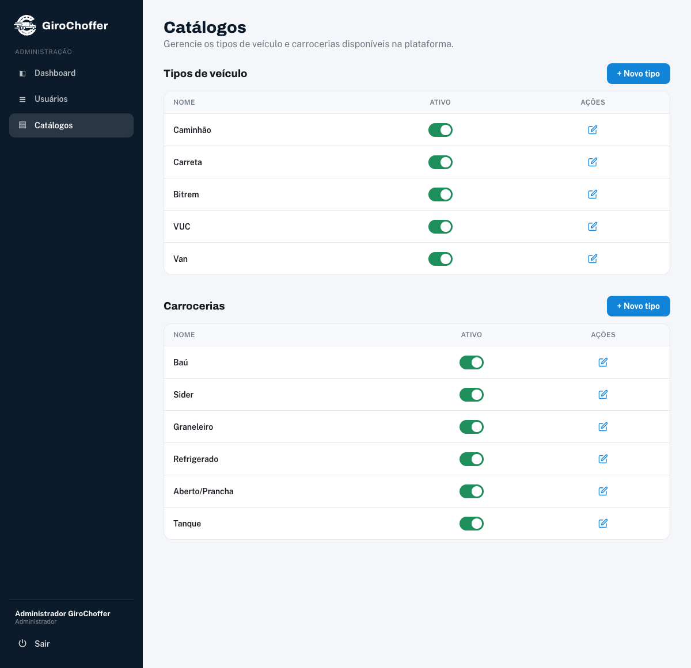
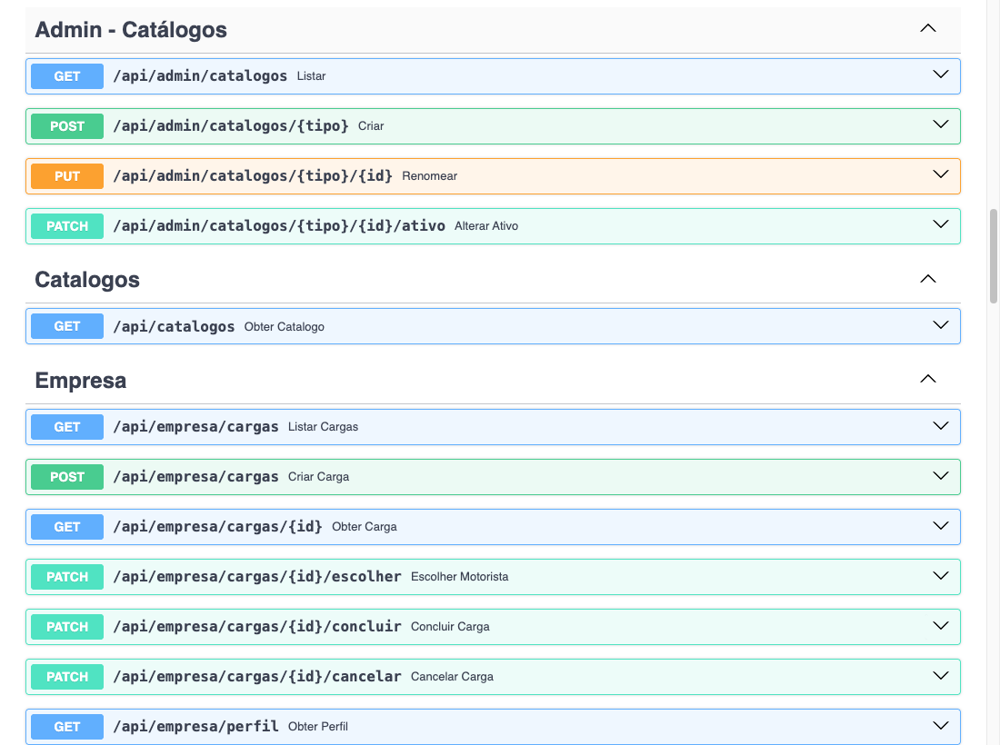
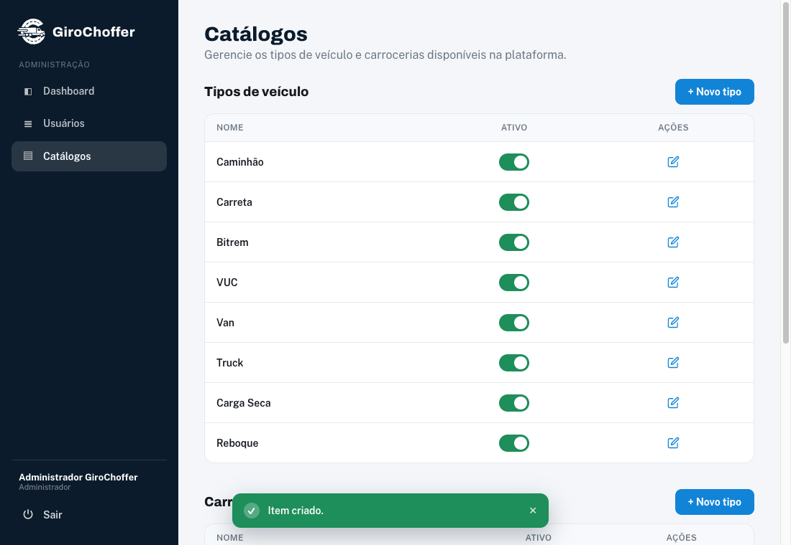
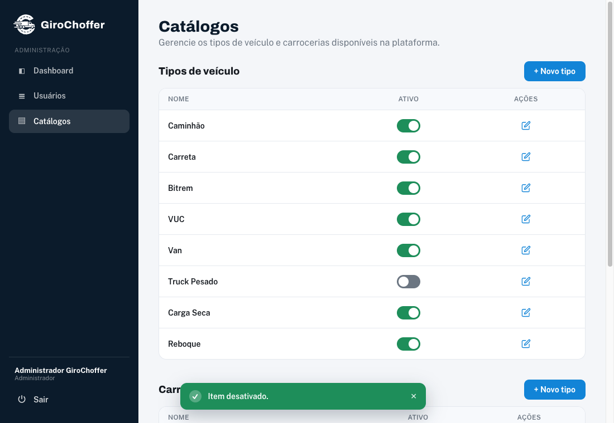
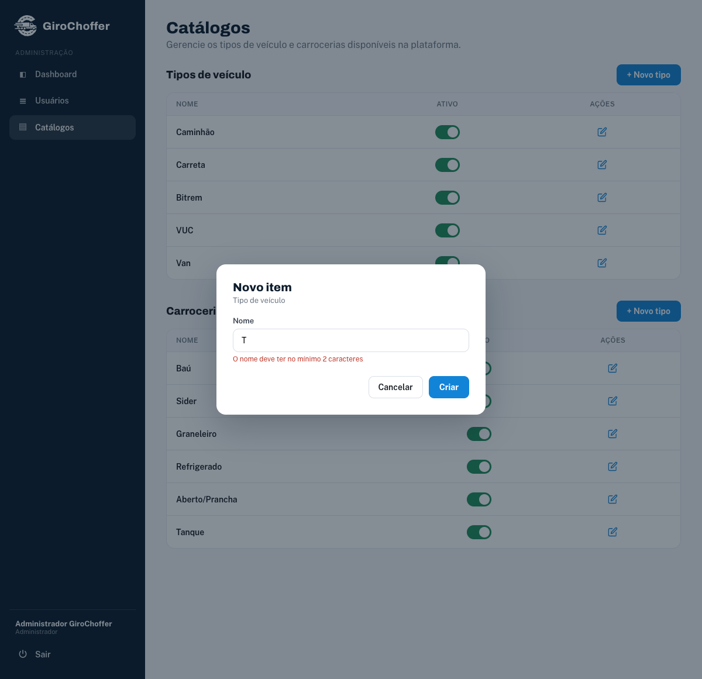

# Tutorial 2 — CRUD admin de tipos de veículo e carroceria

> Tutorial passo a passo, do zero ao funcionando. Feito para quem tem **muita**
> dificuldade. Siga **na ordem**, sem pular nenhum passo. Cada bloco de código
> precisa ser copiado **exatamente** como está.

---

## Setup — preparando seu computador do zero

> Esta seção é para quem nunca rodou o projeto antes. Se o seu ambiente já está
> montado e funcionando, pode pular direto para "O que você vai construir".
> Vamos do absoluto zero: instalar os programas, baixar o código, ligar tudo.
> Faça uma etapa de cada vez e confira a saída de cada comando antes de seguir.

Antes de programar qualquer coisa, você precisa de quatro programas instalados
no computador. Pense neles como as ferramentas básicas da bancada:

- **Git** — guarda o histórico do código e permite baixar o projeto da internet.
- **Python 3.11 ou mais novo** — a linguagem em que o *backend* (o servidor que
  fica nos bastidores) foi escrito.
- **Bun** — o programa que instala e roda as partes do *frontend* (a tela que
  aparece no navegador). Neste projeto o Bun é o gerenciador oficial. **Não use
  `npm`.**
- **VSCode** — o editor de texto onde você vai escrever e ler o código.

### 1. Instalar os programas

Baixe e instale cada um pelos sites oficiais:

- Git: <https://git-scm.com/downloads>
- Python (escolha a versão 3.11, 3.12 ou 3.13): <https://www.python.org/downloads/>
- Bun: <https://bun.sh> (no Windows, siga as instruções da página; no Mac/Linux
  costuma ser um único comando que o site mostra)
- VSCode: <https://code.visualstudio.com>

> No Windows, quando o instalador do Python perguntar, marque a caixa
> **"Add Python to PATH"**. Sem isso, o comando `python` não funciona no
> terminal. É o erro número um de quem está começando.

### 2. Conferir se instalou direito

Abra o **terminal** (no VSCode: menu *Terminal* → *New Terminal*) e rode os três
comandos abaixo, um por vez. Cada um deve responder com um número de versão. Se
algum der "comando não encontrado", a instalação daquele programa falhou — volte
e refaça.

```bash
python --version
bun --version
git --version
```

> Em alguns sistemas (Mac/Linux) o comando do Python pode ser `python3` em vez
> de `python`. Se `python --version` não responder, tente `python3 --version`.
> O importante é a versão começar com **3.11**, **3.12** ou **3.13**.

### 3. Baixar o código do projeto (clonar o repositório)

"Clonar" significa baixar uma cópia completa do projeto, com todo o histórico,
para o seu computador. Escolha uma pasta onde você guarda seus projetos, abra o
terminal nela e rode:

```bash
git clone https://github.com/Artleyfin/girochoffer.git
cd girochoffer
```

Agora você está **dentro** da pasta do projeto. Todos os próximos comandos
partem daqui.

### 4. Criar uma branch para o seu trabalho

Uma **branch** é uma "linha de trabalho paralela": uma cópia do código onde
você faz suas mudanças sem bagunçar a versão principal (a `main`). Se algo der
errado, é só descartar a branch e a `main` continua intacta. Por isso a gente
sempre trabalha numa branch própria, nunca direto na principal.

Crie a sua e já entre nela:

```bash
git checkout -b minha-feature
```

> O `-b` cria a branch e te coloca dentro dela de uma vez. A partir daqui, tudo
> que você editar fica registrado nessa branch separada.

### 5. Preparar o backend (Python)

O backend usa um **ambiente virtual** (a `.venv`): uma caixinha isolada onde as
bibliotecas do projeto são instaladas, sem misturar com o resto do seu Python.
Isso evita conflito entre projetos diferentes.

> **Atenção a uma pegadinha:** o projeto tem um arquivo `.python-version`
> apontando para uma versão muito nova do Python (3.14) que talvez nem exista
> ainda na sua máquina. Ignore esse arquivo e crie a `.venv` com o **Python
> 3.11** (ou 3.12/3.13) que você instalou. Os comandos abaixo fazem exatamente
> isso.

Entre na pasta do backend e crie o ambiente virtual:

```bash
cd backend
python -m venv .venv
```

> Se o seu Python responde por `python3` (caso do Mac/Linux), troque por
> `python3 -m venv .venv` nesta linha. Quem instalou várias versões pode forçar
> a 3.11 com `py -3.11 -m venv .venv` (Windows) ou `python3.11 -m venv .venv`
> (Mac/Linux).

Agora **ative** o ambiente. O comando muda conforme o sistema:

- **Windows (PowerShell):**

```bash
.venv\Scripts\Activate.ps1
```

- **Mac/Linux (ou Git Bash no Windows):**

```bash
source .venv/bin/activate
```

> Deu certo quando aparece `(.venv)` no começo da linha do terminal. É o sinal
> de que você está dentro da caixinha isolada.

Com a `.venv` ativa, instale as bibliotecas que o backend precisa:

```bash
pip install -r requirements.txt
```

### 6. Preparar o frontend (Bun)

Abra **outro terminal** (deixe o primeiro como está), vá para a pasta do
frontend e instale as dependências com o Bun:

```bash
cd frontend
bun install
```

> O `bun install` lê a lista de dependências do projeto e baixa tudo numa pasta
> `node_modules`. É o equivalente ao `pip install` do Python, só que para o
> frontend.

### 7. Ligar tudo

Você vai precisar de **dois terminais rodando ao mesmo tempo**: um para o
backend, outro para o frontend.

- **Terminal 1 — backend** (a partir da raiz do projeto, com a `.venv` ativa):

```bash
backend/.venv/bin/python backend/main.py
```

- **Terminal 2 — frontend** (dentro de `frontend/`):

```bash
bun run dev
```

> O backend sobe na porta **8412** e o frontend na **5182**. Abra o navegador em
> `http://localhost:5182` para ver a tela, e `http://localhost:8412/docs` para a
> documentação dos endpoints (vamos usar bastante).

### 8. Extensões do VSCode

Extensões são "complementos" que deixam o editor mais esperto. Abra o painel de
extensões (ícone de blocos na barra lateral, ou `Ctrl+Shift+X`) e instale:

- **Python** — suporte básico para rodar e entender código Python.
- **Pylance** — completa o código e aponta erros de Python enquanto você digita.
- **Python Debugger** — permite pausar o backend e investigar o que está
  acontecendo passo a passo.
- **Python Environments** — ajuda a escolher e gerenciar a `.venv` certa.
- **ESLint** — aponta erros e más práticas no código do frontend (JS/TS).
- **SQLite3 Editor** — abre e lê o banco de dados do projeto direto no editor.
- **vscode-icons** — coloca ícones bonitos nos arquivos, facilita achar as coisas.
- **HTML CSS Support** — autocompleta classes e tags de HTML/CSS.

> Depois de instalar a extensão Python, abra qualquer arquivo `.py` e, no canto
> inferior do VSCode, selecione o interpretador que aponta para a sua
> `backend/.venv`. Assim o editor usa o Python certo.

Com tudo isso pronto, você está com o ambiente montado e o projeto rodando.
Agora sim, vamos ao que você vai construir.

---

## O que você vai construir

Hoje o catálogo logístico do GiroChoffer (a lista de **tipos de veículo** —
Caminhão, Carreta, Bitrem... — e a lista de **tipos de carroceria** — Baú,
Sider, Graneleiro...) é **fixo**: ele é gravado uma única vez no banco pelo
*seed* (o programinha que enche o banco com dados iniciais quando o projeto sobe
pela primeira vez) e nunca mais muda. Neste tutorial você vai tornar esse
catálogo **editável por administradores**: o admin vai poder **criar** um novo
tipo, **renomear** um tipo existente e **ativar/desativar** um tipo (sem apagar
do banco). Esse conjunto de operações — criar, ler, atualizar e desativar — é o
que se chama de **CRUD** (do inglês *Create, Read, Update, Delete*); é o
feijão-com-arroz de quase todo sistema. Você vai implementar isso **ponta a
ponta** (ou seja, da tela até o banco de dados, passando por tudo no meio):
banco → SQL → repositório → DTO → response → rota → registro no startup →
cliente HTTP → tipos → Zod → página React → rota/menu do frontend. Calma: cada
uma dessas palavras vai ser explicada no momento certo.

Resultado final, depois de tudo pronto:

- Uma nova tela em **`/admin/catalogos`** acessível só por administrador.
- Nela o admin **lista** tipos de veículo e carrocerias (ativos e inativos).
- Botão **"+ Novo tipo"** para criar (abre um modal).
- Botão de **editar** (lápis) para renomear.
- Um **toggle** (chave liga/desliga) para ativar/desativar cada item.
- Novos **endpoints** no backend: `POST/PUT/PATCH /api/admin/catalogos/...`.
  Um **endpoint** é um endereço do servidor que o frontend chama para pedir ou
  enviar dados (tipo uma "porta de atendimento" da API). Esses ficam
  protegidos por **guarda de Admin** (uma trava que só deixa passar quem está
  logado como administrador) e **rate limit** (um limite de quantas vezes por
  minuto dá para chamar, para ninguém abusar), exatamente no mesmo estilo de
  `admin_usuarios_routes.py`.

A tela pronta fica assim (duas tabelas, com toggle e botão de renomear por linha):



> As tabelas `tipo_veiculo` e `tipo_carroceria` **já existem** e **já têm** a
> coluna `ativo`. Você **não vai criar tabela nova** — vai apenas adicionar
> comandos SQL e funções para **atualizar** (renomear) e **mudar o ativo**, e
> uma rota de listagem que devolve **todos** (ativos e inativos), porque a
> listagem pública atual só devolve os ativos.

---

## Pré-requisitos

Se você seguiu a seção de Setup, já tem tudo isto pronto. Vale relembrar: o
backend e o frontend precisam estar **rodando ao mesmo tempo**, em dois
terminais separados.

### 1. Subir o backend (a partir da raiz do projeto)

```bash
backend/.venv/bin/python backend/main.py
```

> Atenção: o projeto usa o Python da **venv** (aquele ambiente isolado,
> `backend/.venv/bin/python`). Não use o `python` puro do sistema, senão faltam
> as bibliotecas. O backend sobe na porta **8412**. A documentação interativa
> (o **Swagger**, uma página que lista e testa os endpoints) fica em
> `http://localhost:8412/docs` — você vai usar bastante para testar.

### 2. Subir o frontend (em outro terminal, a partir de `frontend/`)

```bash
cd frontend
bun run dev
```

> O Vite (a ferramenta que serve o frontend) sobe na porta **5182** e
> redireciona tudo que começa com `/api` para o backend
> (`http://127.0.0.1:8412`). Assim, do navegador, parece que tela e servidor
> estão no mesmo lugar. Abra `http://localhost:5182`.

### 3. Entrar como administrador

Para acessar a área `/admin` você precisa estar logado com perfil
**Administrador**. Esse usuário admin já vem pronto: ele é criado pelo *seed*
(o tal carregador de dados iniciais, a partir de `data/admin_seed.json`). Faça
login com ele antes de testar a tela nova.

---

## As camadas e a ordem de implementação

Este projeto é organizado em **camadas** bem separadas — pense numa pilha de
andares, onde cada andar tem uma função. A regra de ouro é: **construa de baixo
para cima** (do banco até a tela). Por quê? Porque cada andar de cima **depende**
do de baixo. Se você começar pela tela, não vai ter endpoint para ela chamar; se
começar pela rota, não vai ter função no repositório para ela usar. Indo de
baixo para cima, cada passo já pode ser testado apoiado no anterior, que já
ficou pronto.

Antes da tabela, dois termos que vão aparecer bastante:

- **DTO** (*Data Transfer Object*, "objeto de transferência de dados"): é o
  formato dos dados que **chegam** numa requisição. Ele serve de filtro: valida
  o que o usuário mandou antes de o sistema confiar naquilo.
- **Response**: é o formato dos dados que o servidor **devolve** para a tela. O
  oposto do DTO de entrada.

Ordem que vamos seguir:

| # | Camada | Arquivo | Tipo |
|---|--------|---------|------|
| 1 | SQL (banco) | `backend/sql/catalogo_sql.py` | EDIÇÃO |
| 2 | Repositório | `backend/repo/catalogo_repo.py` | EDIÇÃO |
| 3 | DTO de entrada | `backend/dtos/catalogo_dto.py` | ARQUIVO NOVO |
| 4 | Response (saída) | `backend/dtos/responses/catalogo_response.py` | EDIÇÃO |
| 5 | Rota admin | `backend/routes/admin_catalogos_routes.py` | ARQUIVO NOVO |
| 6 | Registrar o router | `backend/main.py` | EDIÇÃO |
| 7 | Tipos do front | `frontend/src/lib/types.ts` | EDIÇÃO |
| 8 | Schema Zod | `frontend/src/lib/schemas.ts` | EDIÇÃO |
| 9 | Página React | `frontend/src/pages/giro/AdminCatalogoPage.tsx` | ARQUIVO NOVO |
| 10 | Registrar rota no router | `frontend/src/router.tsx` | EDIÇÃO |
| 11 | Item no menu admin | `frontend/src/components/giro/AdminLayout.tsx` | EDIÇÃO |

> **Não existe tabela nova** neste tutorial. As tabelas já são criadas no
> startup por `catalogo_repo.criar_tabela()` (passo já feito no projeto). No
> passo 6 você só registra o **router** novo. Guarde isso: registrar o router é
> o passo que os alunos mais esquecem.

> A API central (`frontend/src/lib/api.ts`) **não precisa ser editada** — ela já
> tem `get/post/put/patch/delete`, CSRF e tratamento de erro prontos. Você só
> vai **usá-la**.

---

## Passo 1 — SQL: comandos de atualizar e listar todos

**Arquivo:** `backend/sql/catalogo_sql.py`
**Tipo:** EDIÇÃO

Abra o arquivo. Ele guarda os comandos SQL (a linguagem que conversa com o
banco de dados) separados do resto do código. Tem duas seções: "Tipo de
Veículo" e "Tipo de Carroceria". Cada uma tem constantes com SQL puro
(`CRIAR_TABELA_...`, `INSERIR_...`, `OBTER_ATIVOS_...`, etc.) — guardar o SQL em
constantes deixa tudo num só lugar, fácil de achar e revisar. Vamos
**acrescentar** quatro constantes novas por seção: uma para listar **todos**
(ativos e inativos), uma para **renomear**, uma para **mudar o ativo** e uma
para checar nome duplicado **ignorando** um id (essa última é usada na
renomeação).

### 1a. Tipo de veículo

Logo **abaixo** da constante `OBTER_ATIVOS_TIPO_VEICULO` (linha que termina em
`ORDER BY id`), adicione:

```python
OBTER_TODOS_TIPO_VEICULO = """
SELECT id, nome, ativo
FROM tipo_veiculo
ORDER BY id
"""
```

> Diferença para `OBTER_ATIVOS_...`: aqui **não** há `WHERE ativo = 1`. O admin
> precisa ver também os desativados para poder reativá-los.

Agora, logo **abaixo** de `OBTER_POR_ID_TIPO_VEICULO`, adicione os comandos de
atualização:

```python
ATUALIZAR_TIPO_VEICULO = """
UPDATE tipo_veiculo
SET nome = ?
WHERE id = ?
"""

ATUALIZAR_ATIVO_TIPO_VEICULO = """
UPDATE tipo_veiculo
SET ativo = ?
WHERE id = ?
"""
```

> Use sempre o `?` no lugar dos valores (isso se chama *prepared statement*: o
> banco recebe o comando e os valores separados, e encaixa os valores com
> segurança). **Nunca** monte o SQL grudando o valor direto no texto com
> f-string — isso abre a porta para o *SQL injection*, um truque em que alguém
> esconde comando malicioso dentro de um campo de texto. É proibido no projeto.
> A ordem dos `?` é a mesma ordem dos valores que você vai passar no
> `cursor.execute(...)`: primeiro `nome`, depois `id`.

Por fim, logo **abaixo** de `EXISTE_NOME_TIPO_VEICULO`, adicione uma variante
que ignora um id (para renomear sem colidir com o próprio registro):

```python
EXISTE_NOME_TIPO_VEICULO_OUTRO_ID = """
SELECT COUNT(*) as total
FROM tipo_veiculo
WHERE nome = ? AND id <> ?
"""
```

> `<>` em SQL significa "diferente de". Esta consulta responde a uma pergunta:
> "existe **outro** tipo (com id diferente) que já usa esse nome?". Por que isso
> importa? Sem o `id <> ?`, se você abrir um item e salvar sem mudar o nome, o
> sistema encontraria o próprio item e acharia que é nome duplicado — barrando
> uma edição válida.

### 1b. Tipo de carroceria

Repita exatamente o mesmo, na seção "Tipo de Carroceria". Abaixo de
`OBTER_ATIVOS_TIPO_CARROCERIA`:

```python
OBTER_TODOS_TIPO_CARROCERIA = """
SELECT id, nome, ativo
FROM tipo_carroceria
ORDER BY id
"""
```

Abaixo de `OBTER_POR_ID_TIPO_CARROCERIA`:

```python
ATUALIZAR_TIPO_CARROCERIA = """
UPDATE tipo_carroceria
SET nome = ?
WHERE id = ?
"""

ATUALIZAR_ATIVO_TIPO_CARROCERIA = """
UPDATE tipo_carroceria
SET ativo = ?
WHERE id = ?
"""
```

Abaixo de `EXISTE_NOME_TIPO_CARROCERIA`:

```python
EXISTE_NOME_TIPO_CARROCERIA_OUTRO_ID = """
SELECT COUNT(*) as total
FROM tipo_carroceria
WHERE nome = ? AND id <> ?
"""
```

Pronto. Salve o arquivo. Nenhuma tabela mudou de estrutura; só adicionamos
comandos.

---

## Passo 2 — Repositório: funções de listar todos, renomear e mudar ativo

**Arquivo:** `backend/repo/catalogo_repo.py`
**Tipo:** EDIÇÃO

O **repositório** é a camada que fala com o banco. Em vez de espalhar SQL pelo
sistema, ele junta tudo em funções com nomes claros (`obter_...`,
`atualizar_...`). O resto do código chama essas funções e nem precisa saber SQL.
É essa separação que mantém o projeto organizado.

### 2a. Importar as novas constantes

No topo do arquivo existe um bloco `from sql.catalogo_sql import ( ... )`.
Acrescente, dentro dos parênteses (mantendo as que já estão lá), as constantes
novas:

```python
from sql.catalogo_sql import (
    CRIAR_TABELA_TIPO_VEICULO,
    CRIAR_TABELA_TIPO_CARROCERIA,
    INSERIR_TIPO_VEICULO,
    INSERIR_TIPO_CARROCERIA,
    OBTER_ATIVOS_TIPO_VEICULO,
    OBTER_ATIVOS_TIPO_CARROCERIA,
    OBTER_TODOS_TIPO_VEICULO,
    OBTER_TODOS_TIPO_CARROCERIA,
    OBTER_POR_ID_TIPO_VEICULO,
    OBTER_POR_ID_TIPO_CARROCERIA,
    ATUALIZAR_TIPO_VEICULO,
    ATUALIZAR_TIPO_CARROCERIA,
    ATUALIZAR_ATIVO_TIPO_VEICULO,
    ATUALIZAR_ATIVO_TIPO_CARROCERIA,
    EXISTE_NOME_TIPO_VEICULO,
    EXISTE_NOME_TIPO_CARROCERIA,
    EXISTE_NOME_TIPO_VEICULO_OUTRO_ID,
    EXISTE_NOME_TIPO_CARROCERIA_OUTRO_ID,
    CONTAR_TIPO_VEICULO,
    CONTAR_TIPO_CARROCERIA,
)
```

> Se você esquecer de importar uma constante e usá-la, o Python dá
> `NameError`/`ImportError` ao subir o backend. Importe todas as que você
> adicionou no passo 1.

### 2b. Funções de "obter todos"

Na seção de "Consultas", **abaixo** de `obter_carrocerias_ativas()`, adicione:

```python
def obter_todos_tipos_veiculo() -> list[TipoVeiculo]:
    """Retorna TODOS os tipos de veículo (ativos e inativos), ordenados por id."""
    with obter_conexao() as conn:
        cursor = conn.cursor()
        cursor.execute(OBTER_TODOS_TIPO_VEICULO)
        return [_row_to_tipo_veiculo(row) for row in cursor.fetchall()]


def obter_todas_carrocerias() -> list[TipoCarroceria]:
    """Retorna TODAS as carrocerias (ativas e inativas), ordenadas por id."""
    with obter_conexao() as conn:
        cursor = conn.cursor()
        cursor.execute(OBTER_TODOS_TIPO_CARROCERIA)
        return [_row_to_tipo_carroceria(row) for row in cursor.fetchall()]
```

> Reparou no padrão que se repete? `with obter_conexao() as conn:` abre a
> conexão com o banco (e fecha sozinho no fim, salvando ou desfazendo as
> mudanças automaticamente); pegamos o `cursor` (o "cursor" é quem executa o
> comando e lê o resultado); rodamos o SQL; e transformamos cada linha do banco
> num objeto Python com a função `_row_to_...`, que **já existe** no arquivo. É
> sempre essa receita — copie ela.

### 2c. Funções de renomear (atualizar nome)

**Abaixo** das funções `existe_nome_...`, adicione:

```python
def atualizar_tipo_veiculo(tipo_veiculo_id: int, nome: str) -> bool:
    """Renomeia um tipo de veículo. Retorna True se alguma linha foi alterada."""
    with obter_conexao() as conn:
        cursor = conn.cursor()
        cursor.execute(ATUALIZAR_TIPO_VEICULO, (nome, tipo_veiculo_id))
        return cursor.rowcount > 0


def atualizar_carroceria(tipo_carroceria_id: int, nome: str) -> bool:
    """Renomeia uma carroceria. Retorna True se alguma linha foi alterada."""
    with obter_conexao() as conn:
        cursor = conn.cursor()
        cursor.execute(ATUALIZAR_TIPO_CARROCERIA, (nome, tipo_carroceria_id))
        return cursor.rowcount > 0
```

> `cursor.rowcount` é quantas linhas o `UPDATE` mexeu. Se o id não existir, esse
> número é `0` e a função devolve `False` — mais adiante a rota usa isso para
> saber se deve responder "não encontrado" (404) ou sucesso. A ordem dos valores
> (`nome` e depois o `id`) precisa bater com a ordem dos `?` no SQL.

### 2d. Funções de ativar/desativar

Logo abaixo das anteriores, adicione:

```python
def atualizar_ativo_tipo_veiculo(tipo_veiculo_id: int, ativo: bool) -> bool:
    """Ativa/desativa um tipo de veículo. Retorna True se alterou alguma linha."""
    with obter_conexao() as conn:
        cursor = conn.cursor()
        cursor.execute(ATUALIZAR_ATIVO_TIPO_VEICULO, (1 if ativo else 0, tipo_veiculo_id))
        return cursor.rowcount > 0


def atualizar_ativo_carroceria(tipo_carroceria_id: int, ativo: bool) -> bool:
    """Ativa/desativa uma carroceria. Retorna True se alterou alguma linha."""
    with obter_conexao() as conn:
        cursor = conn.cursor()
        cursor.execute(ATUALIZAR_ATIVO_TIPO_CARROCERIA, (1 if ativo else 0, tipo_carroceria_id))
        return cursor.rowcount > 0
```

> O SQLite não tem um tipo "verdadeiro/falso" próprio: a coluna `ativo` é um
> número inteiro (`INTEGER`). Por isso traduzimos o booleano para número com
> `1 if ativo else 0` (1 = ativo, 0 = inativo), do mesmo jeito que o projeto já
> faz em `inserir_tipo_veiculo`.

### 2e. "Existe nome em outro id" (para a renomeação)

Logo abaixo, adicione:

```python
def existe_nome_tipo_veiculo_outro_id(nome: str, tipo_veiculo_id: int) -> bool:
    """True se OUTRO tipo de veículo (id diferente) já usa esse nome."""
    with obter_conexao() as conn:
        cursor = conn.cursor()
        cursor.execute(EXISTE_NOME_TIPO_VEICULO_OUTRO_ID, (nome, tipo_veiculo_id))
        row = cursor.fetchone()
        return (row["total"] if row else 0) > 0


def existe_nome_carroceria_outro_id(nome: str, tipo_carroceria_id: int) -> bool:
    """True se OUTRA carroceria (id diferente) já usa esse nome."""
    with obter_conexao() as conn:
        cursor = conn.cursor()
        cursor.execute(EXISTE_NOME_TIPO_CARROCERIA_OUTRO_ID, (nome, tipo_carroceria_id))
        row = cursor.fetchone()
        return (row["total"] if row else 0) > 0
```

> Note que `obter_tipo_veiculo(id)` e `obter_carroceria(id)` **já existem** no
> repo — a rota vai usá-las para retornar 404 quando o id não existe e para
> devolver o item atualizado. Não precisa criar.

Salve o arquivo.

---

## Passo 3 — DTO de entrada `CatalogoItemDTO`

**Arquivo:** `backend/dtos/catalogo_dto.py`
**Tipo:** ARQUIVO NOVO

Lembrando: o **DTO** é o formato dos dados que chegam na requisição. Ele é a
"porta de entrada" do servidor, e essa porta tem um segurança: antes de deixar
o dado entrar, confere se ele está no formato certo. Aqui usamos o **Pydantic**
(a biblioteca que faz essa conferência em Python) e reaproveitamos os
verificadores prontos de `dtos/validators.py` (o mesmo esquema do
`usuario_dto.py`). Quando o dado vem errado, o Pydantic reclama e o sistema
devolve automaticamente um erro **422** (o código que significa "você mandou
algo inválido").

Crie o arquivo com este conteúdo completo:

```python
from pydantic import BaseModel, Field, field_validator

from dtos.validators import validar_string_obrigatoria


class CatalogoItemDTO(BaseModel):
    """DTO de entrada para criar ou renomear um item de catálogo (tipo de
    veículo ou carroceria). Apenas o nome — id vem pela URL."""

    nome: str = Field(..., description="Nome do tipo (ex.: Caminhão, Baú)")

    _validar_nome = field_validator("nome")(
        validar_string_obrigatoria(
            nome_campo="Nome",
            tamanho_minimo=2,
            tamanho_maximo=64,
        )
    )


class AtualizarAtivoDTO(BaseModel):
    """DTO de entrada para ativar/desativar um item de catálogo."""

    ativo: bool = Field(..., description="Define se o item fica ativo (True) ou inativo (False)")
```

> - `Field(...)` com aquelas reticências (`...`) quer dizer **campo
>   obrigatório**: sem ele, a requisição é recusada.
> - `validar_string_obrigatoria(...)` é uma *factory* — uma função que
>   **fabrica e devolve outra função**, a de validação, já configurada com os
>   limites que você passou. O `field_validator("nome")` então usa essa função
>   no campo `nome`. É o mesmo esquema do `usuario_dto.py`
>   (`field_validator("nome")(validar_nome_pessoa())`).
> - `tamanho_minimo`/`tamanho_maximo` obrigam o nome a ter entre 2 e 64 letras.
> - O `AtualizarAtivoDTO` recebe só um verdadeiro/falso. Não precisa de
>   verificador especial — o Pydantic sozinho já garante que `ativo` seja
>   booleano.

---

## Passo 4 — Response: adicionar item com `ativo`

**Arquivo:** `backend/dtos/responses/catalogo_response.py`
**Tipo:** EDIÇÃO

Lembrando: o **response** é o formato dos dados que o servidor **devolve** para
a tela. O response que já existe (`ItemCatalogoResponse`) só tem `id` e `nome` —
ótimo para a lista que o público vê, mas o admin precisa enxergar também se o
item está **ativo**. Em vez de mexer no que já funciona, vamos criar um response
novo (o público continua com o `ItemCatalogoResponse` de sempre).

No fim do arquivo, **abaixo** da classe `CatalogoResponse`, adicione:

```python
class ItemCatalogoAdminResponse(BaseModel):
    """Item de catálogo para a área admin (inclui o status ativo)."""

    id: int
    nome: str
    ativo: bool

    @classmethod
    def de_tipo_veiculo(cls, tipo: TipoVeiculo) -> "ItemCatalogoAdminResponse":
        """Constrói o response a partir de um TipoVeiculo."""
        return cls(id=tipo.id, nome=tipo.nome, ativo=tipo.ativo)

    @classmethod
    def de_carroceria(cls, tipo: TipoCarroceria) -> "ItemCatalogoAdminResponse":
        """Constrói o response a partir de um TipoCarroceria."""
        return cls(id=tipo.id, nome=tipo.nome, ativo=tipo.ativo)


class CatalogoAdminResponse(BaseModel):
    """Catálogo completo para o admin (inclui itens ativos E inativos)."""

    tipos_veiculo: list[ItemCatalogoAdminResponse]
    carrocerias: list[ItemCatalogoAdminResponse]

    @classmethod
    def de_listas(
        cls,
        tipos_veiculo: list[TipoVeiculo],
        carrocerias: list[TipoCarroceria],
    ) -> "CatalogoAdminResponse":
        """Constrói o response a partir das listas de entidades de domínio."""
        return cls(
            tipos_veiculo=[
                ItemCatalogoAdminResponse.de_tipo_veiculo(t) for t in tipos_veiculo
            ],
            carrocerias=[
                ItemCatalogoAdminResponse.de_carroceria(c) for c in carrocerias
            ],
        )
```

> - Repare que reusamos os imports que **já estão** no topo do arquivo
>   (`BaseModel`, `TipoVeiculo`, `TipoCarroceria`). Não precisa importar nada
>   novo.
> - Os métodos `de_<entidade>(...)` são *fábricas*: você passa o objeto do banco
>   e eles montam o response pronto. É o jeito do projeto inteiro — a rota nunca
>   monta o response na mão, sempre chama `Response.de_xxx(model)`. Assim o
>   formato de saída fica num lugar só.

---

## Passo 5 — Rota admin `/admin/catalogos`

**Arquivo:** `backend/routes/admin_catalogos_routes.py`
**Tipo:** ARQUIVO NOVO

Esta é a peça central: a **rota**, que define os tais endpoints e diz o que
cada um faz. Em vez de inventar do zero, ela **copia o modelo** de
`admin_usuarios_routes.py`: mesmo `APIRouter` (o objeto do FastAPI que agrupa as
rotas) com prefixo, mesmo limite de uso, mesma trava de Admin
(`@requer_autenticacao([Perfil.ADMIN.value])`), mesmo padrão de
`usuario_logado` + `assert`, mesmos `HTTPException` (a forma de devolver erro).

Como temos **dois** catálogos (veículo e carroceria) que se comportam igual, em
vez de escrever tudo duas vezes, a gente coloca o tipo num pedaço da URL
(`tipo_veiculo` ou `tipo_carroceria`) e, lá dentro, escolhe a função de
repositório certa conforme esse pedaço. Crie o arquivo:

```python
# =============================================================================
# Rotas de Administração de Catálogos (API JSON) — CRUD admin-only
# Espelha admin_usuarios_routes.py: guarda Admin + rate limit.
# Cobre tipos de veículo e tipos de carroceria.
# =============================================================================

from typing import Optional

from fastapi import APIRouter, HTTPException, Request, status

# DTOs (entrada)
from dtos.catalogo_dto import CatalogoItemDTO, AtualizarAtivoDTO

# Schemas (saída)
from dtos.responses.catalogo_response import (
    CatalogoAdminResponse,
    ItemCatalogoAdminResponse,
)

# Models
from model.usuario_logado_model import UsuarioLogado

# Repositories
from repo import catalogo_repo

# Utilities
from util.api_helpers import checar_rate_limit
from util.auth_decorator import requer_autenticacao
from util.logger_config import logger
from util.perfis import Perfil
from util.rate_limiter import DynamicRateLimiter

# =============================================================================
# Configuração do Router
# =============================================================================

router = APIRouter(prefix="/admin/catalogos")

# =============================================================================
# Rate Limiter
# =============================================================================

admin_catalogos_limiter = DynamicRateLimiter(
    chave_max="rate_limit_admin_catalogos_max",
    chave_minutos="rate_limit_admin_catalogos_minutos",
    padrao_max=10,
    padrao_minutos=1,
    nome="admin_catalogos",
)

# =============================================================================
# Helpers — despacho por tipo de catálogo
# =============================================================================

TIPOS_VALIDOS = ("tipo_veiculo", "tipo_carroceria")


def _validar_tipo_catalogo(tipo: str) -> None:
    """Garante que o segmento da URL é um catálogo conhecido (404 se não for)."""
    if tipo not in TIPOS_VALIDOS:
        raise HTTPException(
            status_code=status.HTTP_404_NOT_FOUND,
            detail="Catálogo inexistente. Use 'tipo_veiculo' ou 'tipo_carroceria'.",
        )


def _obter_item_ou_404(tipo: str, id: int):
    """Carrega o item do catálogo certo ou lança 404."""
    if tipo == "tipo_veiculo":
        item = catalogo_repo.obter_tipo_veiculo(id)
    else:
        item = catalogo_repo.obter_carroceria(id)
    if not item:
        raise HTTPException(
            status_code=status.HTTP_404_NOT_FOUND, detail="Item não encontrado."
        )
    return item


def _conflito_nome(mensagem_erro: str) -> HTTPException:
    """Monta a HTTPException 409 padronizada para nome já em uso."""
    return HTTPException(
        status_code=status.HTTP_409_CONFLICT,
        detail={
            "detail": mensagem_erro,
            "type": "conflict",
            "errors": {"nome": [mensagem_erro]},
        },
    )


# =============================================================================
# Listagem (todos, ativos e inativos)
# =============================================================================

@router.get("", response_model=CatalogoAdminResponse)
@requer_autenticacao([Perfil.ADMIN.value])
async def listar(request: Request, usuario_logado: Optional[UsuarioLogado] = None):
    """Lista TODOS os tipos de veículo e carrocerias (ativos e inativos)."""
    assert usuario_logado is not None

    tipos_veiculo = catalogo_repo.obter_todos_tipos_veiculo()
    carrocerias = catalogo_repo.obter_todas_carrocerias()
    return CatalogoAdminResponse.de_listas(tipos_veiculo, carrocerias)


# =============================================================================
# Criação
# =============================================================================

@router.post(
    "/{tipo}",
    response_model=ItemCatalogoAdminResponse,
    status_code=status.HTTP_201_CREATED,
)
@requer_autenticacao([Perfil.ADMIN.value])
async def criar(
    request: Request,
    tipo: str,
    dto: CatalogoItemDTO,
    usuario_logado: Optional[UsuarioLogado] = None,
):
    """Cria um novo item no catálogo. Valida nome duplicado (409)."""
    assert usuario_logado is not None
    checar_rate_limit(admin_catalogos_limiter, request)
    _validar_tipo_catalogo(tipo)

    if tipo == "tipo_veiculo":
        if catalogo_repo.existe_nome_tipo_veiculo(dto.nome):
            raise _conflito_nome("Já existe um tipo de veículo com esse nome.")
        novo_id = catalogo_repo.inserir_tipo_veiculo(dto.nome, ativo=True)
    else:
        if catalogo_repo.existe_nome_carroceria(dto.nome):
            raise _conflito_nome("Já existe uma carroceria com esse nome.")
        novo_id = catalogo_repo.inserir_tipo_carroceria(dto.nome, ativo=True)

    if not novo_id:
        raise HTTPException(
            status_code=status.HTTP_500_INTERNAL_SERVER_ERROR,
            detail="Erro ao criar item do catálogo. Tente novamente.",
        )

    logger.info(f"Catálogo '{tipo}' item '{dto.nome}' criado por admin {usuario_logado.id}")
    item = _obter_item_ou_404(tipo, novo_id)
    return _para_response(tipo, item)


# =============================================================================
# Renomear (atualizar nome)
# =============================================================================

@router.put("/{tipo}/{id}", response_model=ItemCatalogoAdminResponse)
@requer_autenticacao([Perfil.ADMIN.value])
async def renomear(
    request: Request,
    tipo: str,
    id: int,
    dto: CatalogoItemDTO,
    usuario_logado: Optional[UsuarioLogado] = None,
):
    """Renomeia um item do catálogo. Valida nome duplicado em outro id (409)."""
    assert usuario_logado is not None
    checar_rate_limit(admin_catalogos_limiter, request)
    _validar_tipo_catalogo(tipo)

    _obter_item_ou_404(tipo, id)  # 404 se não existir

    if tipo == "tipo_veiculo":
        if catalogo_repo.existe_nome_tipo_veiculo_outro_id(dto.nome, id):
            raise _conflito_nome("Já existe um tipo de veículo com esse nome.")
        ok = catalogo_repo.atualizar_tipo_veiculo(id, dto.nome)
    else:
        if catalogo_repo.existe_nome_carroceria_outro_id(dto.nome, id):
            raise _conflito_nome("Já existe uma carroceria com esse nome.")
        ok = catalogo_repo.atualizar_carroceria(id, dto.nome)

    if not ok:
        raise HTTPException(
            status_code=status.HTTP_500_INTERNAL_SERVER_ERROR,
            detail="Erro ao renomear item do catálogo. Tente novamente.",
        )

    logger.info(f"Catálogo '{tipo}' item {id} renomeado por admin {usuario_logado.id}")
    item = _obter_item_ou_404(tipo, id)
    return _para_response(tipo, item)


# =============================================================================
# Ativar/Desativar
# =============================================================================

@router.patch("/{tipo}/{id}/ativo", response_model=ItemCatalogoAdminResponse)
@requer_autenticacao([Perfil.ADMIN.value])
async def alterar_ativo(
    request: Request,
    tipo: str,
    id: int,
    dto: AtualizarAtivoDTO,
    usuario_logado: Optional[UsuarioLogado] = None,
):
    """Ativa ou desativa um item do catálogo."""
    assert usuario_logado is not None
    checar_rate_limit(admin_catalogos_limiter, request)
    _validar_tipo_catalogo(tipo)

    _obter_item_ou_404(tipo, id)  # 404 se não existir

    if tipo == "tipo_veiculo":
        ok = catalogo_repo.atualizar_ativo_tipo_veiculo(id, dto.ativo)
    else:
        ok = catalogo_repo.atualizar_ativo_carroceria(id, dto.ativo)

    if not ok:
        raise HTTPException(
            status_code=status.HTTP_500_INTERNAL_SERVER_ERROR,
            detail="Erro ao alterar status do item. Tente novamente.",
        )

    logger.info(
        f"Catálogo '{tipo}' item {id} ativo={dto.ativo} por admin {usuario_logado.id}"
    )
    item = _obter_item_ou_404(tipo, id)
    return _para_response(tipo, item)


# =============================================================================
# Helper de serialização (escolhe a factory certa do response)
# =============================================================================

def _para_response(tipo: str, item) -> ItemCatalogoAdminResponse:
    """Converte o model do tipo certo no response admin."""
    if tipo == "tipo_veiculo":
        return ItemCatalogoAdminResponse.de_tipo_veiculo(item)
    return ItemCatalogoAdminResponse.de_carroceria(item)
```

Pontos importantes desta rota (todos copiados do jeito que o projeto já faz).
Um **decorator** é aquela linha com `@` em cima de uma função, que adiciona um
comportamento extra a ela (aqui, "exigir login"):

1. **Ordem dos decorators**: `@router.<metodo>(...)` fica **em cima**,
   `@requer_autenticacao([Perfil.ADMIN.value])` **logo abaixo**. Trocar a ordem
   quebra a verificação de login.
2. `request: Request` é o **primeiro** parâmetro. O decorator de login precisa
   dele.
3. `usuario_logado: Optional[UsuarioLogado] = None` na assinatura **e**
   `assert usuario_logado is not None` logo no início do corpo. O decorator
   coloca o usuário ali dentro; o `assert` é a linha-padrão que o projeto sempre
   usa depois do decorator.
4. **Limite de uso**: `checar_rate_limit(admin_catalogos_limiter, request)` em
   toda operação que muda dados, igual ao `admin_usuarios_routes.py`.
5. **Erros pelo `HTTPException`**: 404 (não existe), 409 (nome repetido), 500
   (deu ruim ao salvar). O formato de erro `{detail, type, errors}` é montado
   automaticamente; só no 409 a gente monta o `detail` como dicionário para
   preencher o campo `nome` (igual ao `_conflito_email` do admin de usuários).
6. **`response_model=...`** está sempre presente, e a função sempre devolve pela
   fábrica `ItemCatalogoAdminResponse.de_...`.

---

## Passo 6 — Registrar o router no startup (PASSO QUE MAIS SE ESQUECE)

**Arquivo:** `backend/main.py`
**Tipo:** EDIÇÃO

Atenção, este é o passo que mais gente esquece. Criar o arquivo de rota **não
basta**: o FastAPI só passa a conhecer um router depois que você o **registra**
no app. "Startup" é o momento em que o backend liga e monta tudo. Esse registro
acontece em `main.py`, em dois lugares: o `import` lá no topo e a lista
`ROUTERS`.

### 6a. Importar o router

No bloco de imports de rotas (onde estão `from routes.admin_usuarios_routes
import router as admin_usuarios_router`, etc.), adicione a linha:

```python
from routes.admin_catalogos_routes import router as admin_catalogos_router
```

> Coloque-a junto das outras importações `from routes.* import router as ...`,
> por exemplo logo abaixo da linha do `admin_usuarios_router`.

### 6b. Incluir na lista `ROUTERS`

Localize a lista `ROUTERS = [ ... ]`. Adicione uma tupla nova (cuide da
vírgula). Coloque perto do `admin_usuarios_router`:

```python
ROUTERS = [
    (auth_router, ["Autenticação"], "autenticação"),
    (usuario_router, ["Usuário"], "usuário"),
    (admin_config_router, ["Admin - Configurações"], "admin de configurações"),
    (admin_backups_router, ["Admin - Backups"], "admin de backups"),
    (admin_usuarios_router, ["Admin - Usuários"], "admin de usuários"),
    (admin_catalogos_router, ["Admin - Catálogos"], "admin de catálogos"),  # <-- NOVO
    (catalogo_router, ["Catalogos"], "catalogos"),
    (empresa_router, ["Empresa"], "empresa"),
    (motorista_router, ["Motorista"], "motorista"),
    (admin_dashboard_router, ["Admin - Dashboard"], "admin dashboard"),
]
```

> O loop logo abaixo (`for router, tags, nome in ROUTERS:`) monta tudo sob
> `API_PREFIX = "/api"`. Como o seu `APIRouter` tem `prefix="/admin/catalogos"`,
> os endpoints finais ficam em `/api/admin/catalogos`. **Não há tabela nova**,
> então **não** mexa em `TABELAS` — a tabela já é criada por
> `catalogo_repo.criar_tabela()` no startup.

### 6c. Conferir no Swagger

Salve, deixe o backend reiniciar e abra `http://localhost:8412/docs` (a página
do Swagger). Procure a seção **"Admin - Catálogos"**. Você deve ver os quatro
endpoints: `GET /api/admin/catalogos`, `POST /api/admin/catalogos/{tipo}`,
`PUT /api/admin/catalogos/{tipo}/{id}` e
`PATCH /api/admin/catalogos/{tipo}/{id}/ativo`. Se **não** aparecer, é sinal de
que faltou o passo 6a ou 6b — volte e confira.



---

## Passo 7 — Frontend: tipos espelhados

**Arquivo:** `frontend/src/lib/types.ts`
**Tipo:** EDIÇÃO

Agora começa o **frontend** (a parte que roda no navegador, escrita em
TypeScript). Os "tipos" do TypeScript são descrições do formato dos dados — eles
precisam **bater exatamente** com o que o backend devolve nos responses. Se os
dois não combinarem, o editor não avisa e a tela quebra em silêncio. O front já
tem o `CatalogoItem` (id + nome, sem `ativo`). Vamos só acrescentar a versão
admin, que tem o `ativo`.

Na seção `// ===== Catálogos (referência) =====`, **abaixo** das interfaces
`CatalogoItem`/`Catalogo`, adicione:

```ts
// Versão admin (inclui ativo) — espelha ItemCatalogoAdminResponse / CatalogoAdminResponse
export interface CatalogoItemAdmin {
  id: number
  nome: string
  ativo: boolean
}
export interface CatalogoAdmin {
  tipos_veiculo: CatalogoItemAdmin[]
  carrocerias: CatalogoItemAdmin[]
}
```

> Os nomes dos campos (`tipos_veiculo`, `carrocerias`, `id`, `nome`, `ativo`)
> têm que ser **iguaizinhos** aos do JSON que o backend manda. O backend escreve
> tudo em **snake_case** (palavras_separadas_por_underline). Se você escrever
> `tiposVeiculo` (no estilo camelCase, com letra maiúscula no meio), o
> `data.tipos_veiculo` vem `undefined` ("vazio") e a tela quebra. Copie os nomes
> exatos.

---

## Passo 8 — Frontend: schema Zod

**Arquivo:** `frontend/src/lib/schemas.ts`
**Tipo:** EDIÇÃO

O **Zod** é uma biblioteca que confere o formulário **no navegador**, antes de
mandar nada para o servidor. É a mesma checagem do DTO do backend, só que feita
mais cedo — assim o usuário vê o erro na hora, sem esperar a viagem até o
servidor e de volta. No fim do arquivo, na parte de admin (perto de
`adminEditarUsuarioSchema`), adicione:

```ts
/** Criar/renomear item de catálogo (tipo de veículo ou carroceria). */
export const catalogoItemSchema = z.object({
  nome: z
    .string()
    .trim()
    .min(2, 'O nome deve ter no mínimo 2 caracteres')
    .max(64, 'O nome deve ter no máximo 64 caracteres'),
})
export type CatalogoItemForm = z.infer<typeof catalogoItemSchema>
```

> Os limites (2 a 64) são os mesmos do `validar_string_obrigatoria(tamanho_minimo=2,
> tamanho_maximo=64)` que você pôs no DTO do passo 3. Mantenha os dois lados
> sempre iguais: se o front deixar passar algo que o backend recusa, o usuário só
> descobre o erro depois de enviar (o tal 422). Com os dois iguais, ele vê na
> hora.

---

## Passo 9 — Frontend: página `AdminCatalogoPage`

**Arquivo:** `frontend/src/pages/giro/AdminCatalogoPage.tsx`
**Tipo:** ARQUIVO NOVO

Esta é a tela em si, escrita em React. Ela **copia o modelo** de
`AdminUsuariosPage.tsx`: usa `useFetch` para buscar a lista do servidor, uma
janelinha (*modal*) para criar/editar, o `toast` para mostrar avisos no canto da
tela, e os mesmos estilos do `@/lib/theme`. A diferença é que aqui mostramos
**duas** tabelas (tipos de veículo e carrocerias) e cada linha tem um **toggle**
(aquele botão de liga/desliga) para ativar ou desativar o item.

Crie o arquivo com este conteúdo completo:

```tsx
import { useState } from 'react'
import type { CSSProperties, FormEvent } from 'react'
import { api, ApiError } from '@/lib/api'
import type { CatalogoAdmin, CatalogoItemAdmin } from '@/lib/types'
import { catalogoItemSchema } from '@/lib/schemas'
import { useFetch } from '@/hooks/useFetch'
import { toast } from '@/store/uiStore'
import Spinner from '@/components/ui/Spinner'
import { TextInput } from '@/components/giro/FormControls'
import { colors, fonts } from '@/lib/theme'

/* Gestão do catálogo logístico (admin): listar tipos de veículo e carrocerias
   (ativos e inativos), criar, renomear e ativar/desativar.
   Consome /api/admin/catalogos. Criar/renomear em modal. */

// O segmento da URL que o backend espera para cada catálogo.
type TipoCatalogo = 'tipo_veiculo' | 'tipo_carroceria'

type Erros = Record<string, string>

export default function AdminCatalogoPage() {
  const { data, carregando, erro, recarregar } = useFetch<CatalogoAdmin>(
    (signal) => api.get<CatalogoAdmin>('/admin/catalogos', { signal }),
    [],
  )

  // Modal de criar/renomear
  const [modalAberto, setModalAberto] = useState(false)
  const [tipoAtual, setTipoAtual] = useState<TipoCatalogo>('tipo_veiculo')
  const [editando, setEditando] = useState<CatalogoItemAdmin | null>(null)
  const [nome, setNome] = useState('')
  const [erros, setErros] = useState<Erros>({})
  const [salvando, setSalvando] = useState(false)

  function abrirCriar(tipo: TipoCatalogo) {
    setTipoAtual(tipo)
    setEditando(null)
    setNome('')
    setErros({})
    setModalAberto(true)
  }
  function abrirEditar(tipo: TipoCatalogo, item: CatalogoItemAdmin) {
    setTipoAtual(tipo)
    setEditando(item)
    setNome(item.nome)
    setErros({})
    setModalAberto(true)
  }
  function fechar() {
    setModalAberto(false)
  }

  async function submeter(e: FormEvent) {
    e.preventDefault()
    setErros({})

    const parsed = catalogoItemSchema.safeParse({ nome })
    if (!parsed.success) {
      return setErros(mapZod(parsed.error.flatten().fieldErrors))
    }

    setSalvando(true)
    try {
      if (editando) {
        await api.put(`/admin/catalogos/${tipoAtual}/${editando.id}`, {
          nome: parsed.data.nome,
        })
        toast.sucesso('Item renomeado.')
      } else {
        await api.post(`/admin/catalogos/${tipoAtual}`, {
          nome: parsed.data.nome,
        })
        toast.sucesso('Item criado.')
      }
      fechar()
      recarregar()
    } catch (err) {
      tratarErro(err)
    } finally {
      setSalvando(false)
    }
  }

  async function alternarAtivo(tipo: TipoCatalogo, item: CatalogoItemAdmin) {
    try {
      await api.patch(`/admin/catalogos/${tipo}/${item.id}/ativo`, {
        ativo: !item.ativo,
      })
      toast.sucesso(item.ativo ? 'Item desativado.' : 'Item ativado.')
      recarregar()
    } catch (err) {
      tratarErro(err)
    }
  }

  function tratarErro(err: unknown) {
    if (err instanceof ApiError) {
      if (err.errors) setErros(mapApi(err.errors))
      toast.erro(err.message)
    } else {
      toast.erro((err as Error).message)
    }
  }

  return (
    <div style={{ padding: '32px 36px 56px', maxWidth: 1100 }}>
      <div style={{ marginBottom: 24 }}>
        <h1 style={{ fontFamily: fonts.heading, fontWeight: 800, fontSize: 28, color: colors.inkStrong, margin: '0 0 4px' }}>
          Catálogos
        </h1>
        <p style={{ color: colors.muted, margin: 0 }}>
          Gerencie os tipos de veículo e carrocerias disponíveis na plataforma.
        </p>
      </div>

      {carregando && <Spinner texto="Carregando catálogos..." />}
      {erro && <p style={{ color: '#C0392B' }}>Erro ao carregar catálogos.</p>}

      {data && (
        <>
          <Secao
            titulo="Tipos de veículo"
            tipo="tipo_veiculo"
            itens={data.tipos_veiculo}
            onCriar={abrirCriar}
            onEditar={abrirEditar}
            onAlternar={alternarAtivo}
          />
          <Secao
            titulo="Carrocerias"
            tipo="tipo_carroceria"
            itens={data.carrocerias}
            onCriar={abrirCriar}
            onEditar={abrirEditar}
            onAlternar={alternarAtivo}
          />
        </>
      )}

      {/* Modal criar/renomear */}
      {modalAberto && (
        <div style={overlay} onClick={fechar}>
          <div style={modalCard} onClick={(e) => e.stopPropagation()}>
            <h2 style={{ fontFamily: fonts.heading, fontWeight: 800, fontSize: 20, color: colors.inkStrong, margin: '0 0 4px' }}>
              {editando ? 'Renomear item' : 'Novo item'}
            </h2>
            <p style={{ color: colors.muted, fontSize: 13, margin: '0 0 20px' }}>
              {tipoAtual === 'tipo_veiculo' ? 'Tipo de veículo' : 'Carroceria'}
            </p>

            <form onSubmit={submeter}>
              <div style={{ marginBottom: 14 }}>
                <TextInput
                  label="Nome"
                  value={nome}
                  onChange={(e) => setNome(e.target.value)}
                />
                {erros.nome && <Erro msg={erros.nome} />}
              </div>

              <div style={{ display: 'flex', justifyContent: 'flex-end', gap: 10, marginTop: 22 }}>
                <button type="button" onClick={fechar} style={btnSecundario}>Cancelar</button>
                <button type="submit" disabled={salvando} style={{ ...btnPrimario, opacity: salvando ? 0.7 : 1 }}>
                  {salvando ? 'Salvando...' : editando ? 'Salvar' : 'Criar'}
                </button>
              </div>
            </form>
          </div>
        </div>
      )}
    </div>
  )
}

/* Uma seção = uma tabela (tipos de veículo OU carrocerias). */
function Secao({
  titulo,
  tipo,
  itens,
  onCriar,
  onEditar,
  onAlternar,
}: {
  titulo: string
  tipo: TipoCatalogo
  itens: CatalogoItemAdmin[]
  onCriar: (tipo: TipoCatalogo) => void
  onEditar: (tipo: TipoCatalogo, item: CatalogoItemAdmin) => void
  onAlternar: (tipo: TipoCatalogo, item: CatalogoItemAdmin) => void
}) {
  return (
    <div style={{ marginBottom: 36 }}>
      <div style={{ display: 'flex', alignItems: 'center', justifyContent: 'space-between', marginBottom: 12 }}>
        <h2 style={{ fontFamily: fonts.heading, fontWeight: 800, fontSize: 18, color: colors.ink, margin: 0 }}>
          {titulo}
        </h2>
        <button onClick={() => onCriar(tipo)} style={btnPrimario}>+ Novo tipo</button>
      </div>

      <div style={{ background: '#fff', border: `1px solid ${colors.border}`, borderRadius: 14, overflow: 'hidden' }}>
        <table style={{ width: '100%', borderCollapse: 'collapse', fontSize: 14 }}>
          <thead>
            <tr style={{ background: '#F7F9FC', color: colors.muted, textAlign: 'left' }}>
              <th style={th}>Nome</th>
              <th style={thCentro}>Ativo</th>
              <th style={thCentro}>Ações</th>
            </tr>
          </thead>
          <tbody>
            {itens.map((item) => (
              <tr key={item.id} style={{ borderTop: `1px solid ${colors.border}` }}>
                <td style={{ ...td, fontWeight: 600, color: colors.ink }}>{item.nome}</td>
                <td style={{ ...td, textAlign: 'center' }}>
                  <button
                    onClick={() => onAlternar(tipo, item)}
                    title={item.ativo ? 'Desativar' : 'Ativar'}
                    aria-label={item.ativo ? 'Desativar' : 'Ativar'}
                    style={{
                      ...togglePill,
                      background: item.ativo ? '#1E8E5A' : colors.muted,
                    }}
                  >
                    <span
                      style={{
                        ...toggleKnob,
                        transform: item.ativo ? 'translateX(18px)' : 'translateX(0)',
                      }}
                    />
                  </button>
                </td>
                <td style={{ ...td, textAlign: 'center', whiteSpace: 'nowrap' }}>
                  <button onClick={() => onEditar(tipo, item)} title="Renomear" aria-label="Renomear" style={btnIcone}>
                    <IconeEditar />
                  </button>
                </td>
              </tr>
            ))}
          </tbody>
        </table>
      </div>
    </div>
  )
}

function Erro({ msg }: { msg: string }) {
  return <div style={{ color: '#C0392B', fontSize: 12, marginTop: 5 }}>{msg}</div>
}

function IconeEditar() {
  return (
    <svg width="17" height="17" viewBox="0 0 24 24" fill="none" stroke="currentColor" strokeWidth="2" strokeLinecap="round" strokeLinejoin="round" aria-hidden="true">
      <path d="M11 4H4a2 2 0 0 0-2 2v14a2 2 0 0 0 2 2h14a2 2 0 0 0 2-2v-7" />
      <path d="M18.5 2.5a2.121 2.121 0 0 1 3 3L12 15l-4 1 1-4Z" />
    </svg>
  )
}

function mapZod(fe: Record<string, string[] | undefined>): Erros {
  const m: Erros = {}
  for (const [k, v] of Object.entries(fe)) if (v && v.length) m[k] = v[0]
  return m
}
function mapApi(errs: Record<string, string[]>): Erros {
  const m: Erros = {}
  for (const [k, v] of Object.entries(errs)) if (v && v.length) m[k] = v[0]
  return m
}

const th: CSSProperties = { padding: '12px 16px', fontWeight: 600, fontSize: 12, textTransform: 'uppercase', letterSpacing: '.3px' }
const thCentro: CSSProperties = { ...th, textAlign: 'center' }
const td: CSSProperties = { padding: '13px 16px' }
const btnPrimario: CSSProperties = {
  padding: '10px 18px',
  background: colors.primary,
  color: '#fff',
  border: 'none',
  borderRadius: 9,
  fontWeight: 700,
  fontSize: 14,
  cursor: 'pointer',
}
const btnSecundario: CSSProperties = {
  padding: '10px 16px',
  background: '#fff',
  color: colors.ink,
  border: `1px solid ${colors.borderInput}`,
  borderRadius: 9,
  fontWeight: 600,
  fontSize: 14,
  cursor: 'pointer',
}
const btnIcone: CSSProperties = {
  background: 'transparent',
  border: 'none',
  color: colors.primary,
  cursor: 'pointer',
  padding: 6,
  borderRadius: 8,
  display: 'inline-flex',
  alignItems: 'center',
  margin: '0 2px',
}
const togglePill: CSSProperties = {
  width: 42,
  height: 24,
  borderRadius: 999,
  border: 'none',
  cursor: 'pointer',
  padding: 3,
  display: 'inline-flex',
  alignItems: 'center',
}
const toggleKnob: CSSProperties = {
  width: 18,
  height: 18,
  borderRadius: '50%',
  background: '#fff',
  display: 'block',
  transition: 'transform .15s ease',
}
const overlay: CSSProperties = {
  position: 'fixed',
  inset: 0,
  background: 'rgba(11,27,43,.5)',
  display: 'flex',
  alignItems: 'center',
  justifyContent: 'center',
  zIndex: 50,
  padding: 20,
}
const modalCard: CSSProperties = {
  background: '#fff',
  borderRadius: 16,
  padding: 28,
  width: '100%',
  maxWidth: 460,
  boxShadow: '0 20px 60px rgba(11,27,43,.25)',
}
```

Pontos importantes:

1. **`useFetch`** busca o `GET /api/admin/catalogos` e te devolve
   `{data, carregando, erro, recarregar}` (os dados, mais avisos de "está
   carregando" e "deu erro", mais uma função para recarregar). O endereço é
   contado a partir de `/api` — por isso escrevemos só `/admin/catalogos`.
2. **Toda chamada passa pelo `api`** (`api.get/post/put/patch`). Nunca use o
   `fetch` cru do navegador — o `api` já cuida do cookie de login, do token de
   segurança (CSRF) e do formato dos erros para você.
3. **Nomes no estilo certo de cada lado.** O corpo que você envia usa exatamente
   as chaves que o backend espera: `{ nome }` e `{ ativo }`.
4. **Avisos só com `toast`** (`toast.sucesso/erro`), aquela mensagenzinha que
   aparece e some. Nunca o `alert()` feio do navegador.
5. Depois de cada mudança a gente chama **`recarregar()`** para a lista mostrar
   o estado novo.
6. Os erros 422 do backend chegam em `err.errors` (em snake_case, na chave
   `nome`); a função `mapApi` joga esse erro para baixo do campo no formulário.

---

## Passo 10 — Registrar a rota no router do frontend

**Arquivo:** `frontend/src/router.tsx`
**Tipo:** EDIÇÃO

Igual ao backend, criar a página **não basta**: o React Router (o sistema que
decide qual tela mostrar para cada endereço) precisa conhecê-la. São duas
mudanças: o `import` e a entrada no grupo `<AdminRoute>`.

### 10a. Importar a página

No bloco `// Admin` dos imports (onde estão `AdminDashboardPage` e
`AdminUsuariosPage`), adicione:

```tsx
import AdminCatalogoPage from './pages/giro/AdminCatalogoPage'
```

### 10b. Adicionar a rota dentro do grupo admin

Localize o bloco `// ===== Admin =====` (o que tem `element: <AdminRoute />`).
Dentro dos `children` do `<AdminLayout />`, adicione a rota nova:

```tsx
      // ===== Admin =====
      {
        element: <AdminRoute />,
        children: [
          {
            element: <AdminLayout />,
            children: [
              { path: '/admin', element: <AdminDashboardPage /> },
              { path: '/admin/usuarios', element: <AdminUsuariosPage /> },
              { path: '/admin/catalogos', element: <AdminCatalogoPage /> },  // <-- NOVO
            ],
          },
        ],
      },
```

> A página fica **dentro** de `<AdminRoute>` (a trava que só deixa entrar quem é
> Administrador) e de `<AdminLayout>` (a moldura da tela, com o menu lateral, a
> *sidebar*). Por que importa? Se você puser fora do `<AdminRoute>`, qualquer
> usuário entraria na tela; se puser fora do `<AdminLayout>`, o menu lateral
> some.

---

## Passo 11 — Adicionar o item no menu admin

**Arquivo:** `frontend/src/components/giro/AdminLayout.tsx`
**Tipo:** EDIÇÃO

Falta o admin conseguir **chegar** na tela pelo menu lateral. Para isso, adicione
um item ao array `NAV` (a lista de itens do menu), no topo do componente:

```tsx
const NAV: { label: string; path: string; icon: string }[] = [
  { label: 'Dashboard', path: '/admin', icon: '◧' },
  { label: 'Usuários', path: '/admin/usuarios', icon: '☰' },
  { label: 'Catálogos', path: '/admin/catalogos', icon: '▤' },
]
```

> O `path` precisa ser **idêntico** ao registrado no `router.tsx`
> (`/admin/catalogos`). O `icon` é só um caractere decorativo (o projeto usa
> SVG/símbolos inline, sem biblioteca de ícones).

Salve. Recarregue o navegador. O item "Catálogos" deve aparecer na sidebar do
admin.

---

## Como testar

### Teste manual ponta a ponta

1. **Suba o backend** (se não estiver no ar):
   ```bash
   backend/.venv/bin/python backend/main.py
   ```
2. **Suba o frontend** (em outro terminal):
   ```bash
   cd frontend
   bun run dev
   ```
3. Abra `http://localhost:8412/docs` e confirme a seção **"Admin - Catálogos"**
   com os 4 endpoints. Se faltar, revise o **Passo 6**.
4. No navegador (`http://localhost:5182`), **faça login como Administrador**.
5. Clique em **"Catálogos"** na sidebar. Você deve ver duas tabelas
   (Tipos de veículo, Carrocerias) com os itens do seed.
6. **Criar**: clique "+ Novo tipo" numa seção, digite um nome (ex.: `Truck`),
   confirme. Toast verde "Item criado." e o item aparece na lista.

   

7. **Renomear**: clique no lápis de um item, mude o nome, salve. Toast "Item
   renomeado." e o nome muda.
8. **Ativar/desativar**: clique no toggle. Ele muda de cor; o item fica
   inativo/ativo. Toast confirma. (Itens inativos continuam na lista do admin.)

   

9. **Validação de duplicado**: tente criar um item com nome que já existe.
   Você deve ver um toast de erro vermelho ("Já existe..."), vindo do **409**
   do backend.
10. **Validação de nome curto**: tente salvar com 1 caractere. O Zod barra
    antes de enviar e mostra a mensagem embaixo do campo.

    

### Teste rápido pelo Swagger (sem a tela)

Em `http://localhost:8412/docs`, expanda `POST /api/admin/catalogos/{tipo}`,
clique em **"Try it out"**, ponha `tipo` = `tipo_veiculo` e o corpo:

```json
{ "nome": "Truck" }
```

Você deve receber **201** com `{ "id": ..., "nome": "Truck", "ativo": true }`.
Repetindo o mesmo nome deve dar **409**.

> **Importante sobre o login no Swagger**: como essas rotas exigem Admin, você
> precisa estar com a sessão de admin ativa (o tal cookie de login guardado no
> navegador). O jeito mais fácil é primeiro logar pela tela do site (o "SPA", a
> aplicação que roda no navegador) e só depois abrir o `/docs` — em
> desenvolvimento os dois ficam no mesmo endereço, então o login vale para os
> dois. As operações que mudam dados também pedem o token de segurança CSRF; pela
> tela do site isso é resolvido sozinho.

### Padrão de testes do projeto (opcional)

O backend usa **pytest** (a partir de `backend/`):

```bash
backend/.venv/bin/python -m pytest tests/integration
```

Um teste de integração simples para a criação seguiria o estilo que já existe:
logar como admin, mandar `POST /api/admin/catalogos/tipo_veiculo` com
`{"nome": "Truck"}` e conferir se voltou `status_code == 201` e o JSON certo.
Dá uma olhada nos testes que já estão em `backend/tests/integration/` para
copiar o *fixture* (o pedacinho de preparação que já entrega um cliente logado
como admin, pronto para usar).

---

## Erros comuns e como resolver

1. **"Esqueci de registrar o router" → endpoint não existe (404).**
   Sintoma: a tela carrega vazia/erro e `GET /api/admin/catalogos` dá 404; a
   seção não aparece no `/docs`. Causa: faltou o **Passo 6** (import + tupla na
   lista `ROUTERS`). Solução: refaça o Passo 6 e reinicie o backend.

2. **Contrato backend/front não bate (campo `undefined`).**
   Sintoma: a tela mostra a lista vazia mesmo havendo dados, ou
   `Cannot read properties of undefined`. Causa: nome de campo divergente
   (ex.: front esperando `tiposVeiculo` em vez de `tipos_veiculo`, ou response
   sem `ativo`). Solução: confira que o JSON do backend (veja no `/docs` ou no
   Network do navegador) tem **exatamente** `tipos_veiculo`, `carrocerias`,
   `id`, `nome`, `ativo`, e que `types.ts` (Passo 7) usa os mesmos nomes.

3. **CSRF / 403 ao salvar.**
   Sintoma: criar/renomear/toggle retorna 403. Causa: chamada feita sem o
   header `X-CSRF-Token`. Solução: use **sempre** o `api` de `@/lib/api`
   (nunca `fetch` cru) — ele injeta o CSRF automaticamente nas mutações. Se
   persistir, recarregue a página para renovar o token.

4. **Tipos do Zod não casam com o DTO.**
   Sintoma: o front deixa enviar e o backend devolve 422 com mensagem que a tela
   não esperava. Causa: limites diferentes entre `catalogoItemSchema` (Zod) e
   `CatalogoItemDTO` (Pydantic). Solução: mantenha os dois com mín. 2 / máx. 64.

5. **Decorators na ordem errada na rota.**
   Sintoma: a rota não exige login, ou dá erro estranho de injeção. Causa:
   `@requer_autenticacao(...)` colocado **acima** do `@router.<metodo>`.
   Solução: `@router.<metodo>(...)` sempre **em cima**, `@requer_autenticacao`
   **logo abaixo** da função.

6. **Esqueceu `assert usuario_logado is not None` ou o parâmetro na assinatura.**
   Sintoma: erro de `None` ou o FastAPI tenta validar `usuario_logado` como
   campo de query. Solução: mantenha
   `usuario_logado: Optional[UsuarioLogado] = None` na assinatura **e** o
   `assert` no início do corpo — é o padrão fixo do projeto.

7. **`NameError`/`ImportError` ao subir o backend.**
   Sintoma: o backend não sobe. Causa: usou uma constante SQL ou função de repo
   que esqueceu de importar/criar (Passo 1 ou 2). Solução: confira que toda
   constante usada no repo está no `from sql.catalogo_sql import (...)`.

---

## Checklist final

Marque cada caixa só depois de conferir de verdade.

**Backend**
- [ ] `catalogo_sql.py`: adicionadas `OBTER_TODOS_*`, `ATUALIZAR_*`,
      `ATUALIZAR_ATIVO_*` e `EXISTE_NOME_*_OUTRO_ID` para os dois catálogos.
- [ ] `catalogo_repo.py`: importadas as constantes novas.
- [ ] `catalogo_repo.py`: criadas `obter_todos_tipos_veiculo`,
      `obter_todas_carrocerias`, `atualizar_tipo_veiculo`,
      `atualizar_carroceria`, `atualizar_ativo_tipo_veiculo`,
      `atualizar_ativo_carroceria`, `existe_nome_tipo_veiculo_outro_id`,
      `existe_nome_carroceria_outro_id`.
- [ ] `dtos/catalogo_dto.py` (NOVO): `CatalogoItemDTO` e `AtualizarAtivoDTO`.
- [ ] `dtos/responses/catalogo_response.py`: `ItemCatalogoAdminResponse` e
      `CatalogoAdminResponse`.
- [ ] `routes/admin_catalogos_routes.py` (NOVO): router `/admin/catalogos` com
      `GET`, `POST /{tipo}`, `PUT /{tipo}/{id}`, `PATCH /{tipo}/{id}/ativo`,
      guarda Admin e rate limit.
- [ ] `main.py`: **import** do `admin_catalogos_router` **e** tupla na lista
      `ROUTERS`.
- [ ] No `/docs` aparece a seção **"Admin - Catálogos"** com os 4 endpoints.

**Frontend**
- [ ] `types.ts`: `CatalogoItemAdmin` e `CatalogoAdmin`.
- [ ] `schemas.ts`: `catalogoItemSchema` (+ tipo `CatalogoItemForm`).
- [ ] `pages/giro/AdminCatalogoPage.tsx` (NOVO): lista, criar, renomear,
      toggle, usando `api`, `useFetch` e `toast`.
- [ ] `router.tsx`: **import** da página **e** rota `/admin/catalogos` dentro de
      `<AdminRoute>` + `<AdminLayout>`.
- [ ] `AdminLayout.tsx`: item "Catálogos" no array `NAV`.

**Teste**
- [ ] Logado como Admin, a tela `/admin/catalogos` lista os dois catálogos.
- [ ] Criar funciona (201 + toast verde).
- [ ] Renomear funciona.
- [ ] Toggle de ativo funciona.
- [ ] Nome duplicado dá erro 409 (toast vermelho).
- [ ] Nome curto é barrado pelo Zod antes de enviar.

Se todas as caixas estão marcadas, a feature está completa e funcionando.
Bom trabalho!
